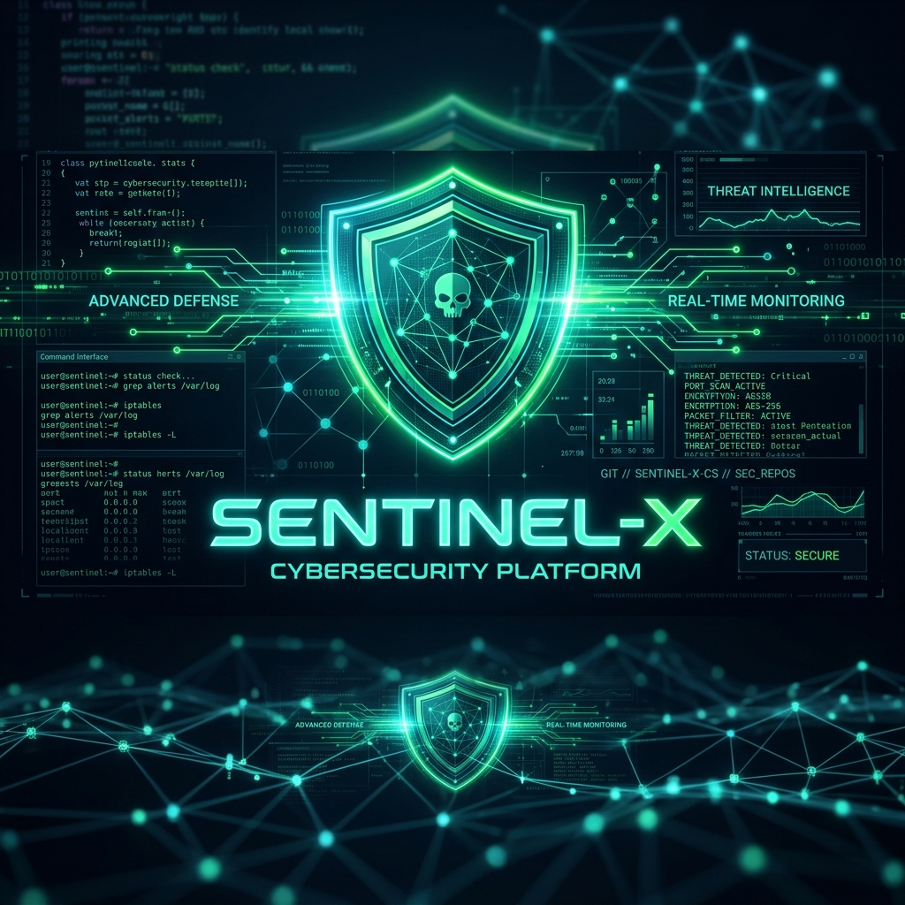

# 🛡️ CIBER - Repositorio de Ciberseguridad y Telecomunicaciones

¡Bienvenido al repositorio central de **CIBER**! Este espacio está diseñado como una biblioteca de herramientas, scripts y laboratorios prácticos sobre seguridad informática, redes y telecomunicaciones. El repositorio está organizado de forma progresiva, desde scripts básicos de automatización hasta simulaciones complejas de Red Team/Blue Team y sistemas con interfaces visuales interactivas.

---

## 🗂️ Estructura del Repositorio

El repositorio se divide en tres niveles de dificultad y una sección especial para arquitecturas y dashboards interactivos complejos:

### 🟢 [Nivel Básico (10 Proyectos)](ciberseguridad/nivel_basico)
Herramientas fundamentales de criptografía, escaneo de red básico y análisis forense inicial.
1. **Password Locker**: Almacén seguro con cifrado Fernet.
2. **Port Scanner**: Escáner de puertos TCP mediante sockets raw.
3. **Hash Cracker**: Descifrado de hashes por fuerza bruta/diccionario.
4. **Log Analyzer**: Filtro de logins fallidos y patrones sospechosos.
5. **File Integrity Checker**: Control de integridad de archivos vía SHA-256.
6. **Keylogger Demo**: Captura de pulsaciones con fines educativos.
7. **Caesar Cipher Tool**: Cifrado clásico César y ataque de fuerza bruta.
8. **Base64 Encoder/Decoder**: Codificador y decodificador CLI.
9. **Vulnerability Scanner**: Escáner básico de cabeceras de seguridad HTTP.
10. **Network Sniffer**: Capturador de paquetes de red básico con Scapy.

### 🟡 [Nivel Intermedio (10 Proyectos)](ciberseguridad/nivel_intermedio)
Automatizaciones multihilo, detección de intrusos e inspección profunda de protocolos.
1. **Password Locker v2**: Gestor robusto con AES-256 y PBKDF2.
2. **Multithreaded Port Scanner**: Escáner ultrarrápido con control de hilos.
3. **Directory Bruteforcer**: Descubrimiento de directorios web ocultos.
4. **Web Login Bruteforce**: Script de fuerza bruta en formularios web (POST).
5. **Packet Sniffer Avanzado**: Capturador con análisis y exfiltración de credenciales.
6. **ARP Spoofer Detector**: Detector de ataques Man-in-the-Middle (MITM).
7. **Basic IDS System**: Sistema de detección de escaneos, SYN/ICMP floods.
8. **Web Vulnerability Scanner**: Escáner de inyecciones XSS y SQL básicas.
9. **SSH Bruteforce Tool**: Fuerza bruta multihilo contra servidores SSH (Paramiko).
10. **Log Monitoring System**: SIEM básico con reglas y alertas personalizables.

### 🔴 [Nivel Avanzado (10 Proyectos)](ciberseguridad/nivel_avanzado)
Herramientas de post-explotación, simuladores de evasión de sandbox y laboratorios controlados de malware.
1. **Custom C2 Simulator**: Servidor y agente de Comando y Control (C2).
2. **Mini Metasploit Framework**: Consola de explotación modular extensible.
3. **Advanced Password Manager**: Gestor auditado con AES-GCM y 600k iteraciones PBKDF2.
4. **Network IDS (NIDS)**: Detección avanzada con flujos e inteligencia de amenazas.
5. **Web Pentesting Framework**: Suite modular para auditorías web.
6. **Privilege Escalation Lab**: Auditoría local de SUID, cronjobs y exploits de kernel.
7. **Malware Analysis Lab**: Extractor estático de IOCs y cálculo de entropía.
8. **Ransomware Simulator**: Simulación de cifrado y descifrado controlado.
9. **Threat Hunting Lab**: Caza proactiva de intrusos mediante análisis de eventos.
10. **Red Team Lab Simulation**: Simulación de ciclo de vida completo de intrusión.

### 🚀 [Proyectos Futuros y Avanzados (con Interfaz Visual)](ciberseguridad/proyectos_futuros)
Visualizaciones web interactivas (Dashboards HTML/CSS/JS) para simular consolas operativas.
*   **01_simulador_apt**: Dashboard C2 de control táctico.
*   **02_analizador_malware_ia**: Simulación visual de detección heurística.
*   **03_red_team_framework**: Consola de exploits en entorno web interactivo.
*   **04_siem_dashboard**: Monitor interactivo de eventos agregados en tiempo real.
*   **05_honeypots_interactivos**: Mapa global visualizando ataques de señuelos.
*   **06_phishing_manager**: Gestor visual de plantillas y simulaciones de phishing.
*   **07_mapeador_superficie_ataque**: Topología interactiva de red con análisis de vulnerabilidades.

---

## 📖 Wiki del Repositorio
Para una explicación más didáctica de cada uno de los proyectos, diagramas de arquitectura (Mermaid) y guías de uso paso a paso, visita la [Wiki de GitHub](https://github.com/lucasmdg/CIBER/wiki).

---

> ⚠️ **Nota de Seguridad**: Todos los proyectos y herramientas presentes en este repositorio se han creado exclusivamente con propósitos educativos y de investigación ética. Úsalos únicamente en entornos controlados y bajo autorización explícita.
