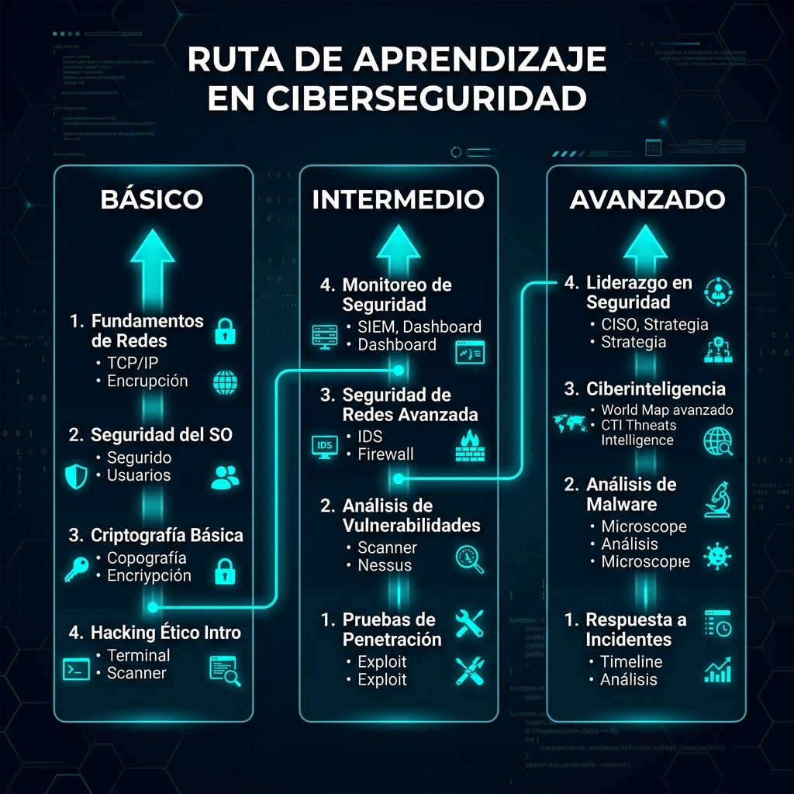

<div align="center">


# 🛡️ CIBER — Laboratorio de Ciberseguridad

[](https://python.org)
[](https://github.com/lucasmdg/CIBER)
[](https://github.com/lucasmdg/CIBER)
[](https://github.com/lucasmdg/CIBER/wiki)
[](https://github.com/lucasmdg/CIBER)

</div>

---

## 👤 Sobre mí

<div align="center">


</div>

```
┌─────────────────────────────────────────────────────────────────┐
│  $ whoami                                                       │
│                                                                 │
│  Lucas Méndez Díez                                              │
│  ─────────────────                                              │
│  Telecom & Cybersecurity Engineer                               │
│  FP Superior — Sistemas de Telecomunicaciones e Informáticos    │
│                                                                 │
│  $ cat skills.txt                                               │
│                                                                 │
│  [Lenguajes]   Python · Java · C/C++ · Bash                     │
│  [Redes]       Fibra Óptica · TCP/IP · VLAN · VPN · DNS        │
│  [Seguridad]   Red Team · Blue Team · Pentesting · OSINT        │
│  [Sistemas]    Linux · Windows Server · Virtualización          │
│  [Herramientas] Scapy · Paramiko · Cryptography · Metasploit   │
│                                                                 │
│  $ cat intereses.txt                                            │
│                                                                 │
│  ├── Ciberseguridad Ofensiva (Red Team)                         │
│  ├── Defensa y Detección de Intrusiones (Blue Team)             │
│  ├── Infraestructura de Redes y Telecomunicaciones              │
│  └── Desarrollo de Herramientas de Seguridad en Python          │
│                                                                 │
│  $ echo $STATUS                                                 │
│  Abierto a oportunidades en ciberseguridad                      │
└─────────────────────────────────────────────────────────────────┘
```

---

## 🗺️ Mapa de Aprendizaje

<div align="center">



</div>

Este repositorio está organizado de menor a mayor complejidad. Cada proyecto construye sobre los conceptos del anterior, formando una ruta de aprendizaje completa desde los fundamentos hasta la simulación de operaciones reales de Red Team y Blue Team.

```
NIVEL BÁSICO ──────► NIVEL INTERMEDIO ──────► NIVEL AVANZADO ──────► PROYECTOS FUTUROS (UI)
  Cifrado Fernet        AES-256 + PBKDF2         AES-256-GCM              Dashboards interactivos
  Socket TCP            Threading + Queue         C2 Framework             SIEM en tiempo real
  Hashing básico        Packet analysis           NIDS con flujos          Análisis IA de malware
  Log parsing           ARP Detection             Malware static lab       Red Team consola web
```

---

## 🟢 Nivel Básico — Fundamentos

> **Objetivo**: Comprender cómo funcionan por dentro las herramientas de seguridad más comunes. Ideal para comenzar a programar scripts de seguridad en Python.

| # | Proyecto | Conceptos Clave | Dependencias |
|---|----------|-----------------|--------------|
| 01 | [Password Locker](ciberseguridad/nivel_basico/01_password_locker) | Cifrado simétrico Fernet, almacenamiento JSON | `cryptography` |
| 02 | [Port Scanner](ciberseguridad/nivel_basico/02_port_scanner) | Sockets TCP, handshake 3-way, puertos/servicios | `socket` (stdlib) |
| 03 | [Hash Cracker](ciberseguridad/nivel_basico/03_hash_cracker_simple) | MD5, SHA-256, ataque por diccionario | `hashlib` (stdlib) |
| 04 | [Log Analyzer](ciberseguridad/nivel_basico/04_log_analyzer) | Expresiones regulares, parsing de eventos | `re` (stdlib) |
| 05 | [File Integrity Checker](ciberseguridad/nivel_basico/05_file_integrity_checker) | Hashing de archivos, línea base de integridad | `hashlib`, `json` |
| 06 | [Keylogger Demo](ciberseguridad/nivel_basico/06_basic_keylogger_demo) | Hooks de teclado, eventos de entrada del SO | `pynput` |
| 07 | [Caesar Cipher](ciberseguridad/nivel_basico/07_caesar_cipher_tool) | Cifrado de sustitución, aritmética modular | stdlib |
| 08 | [Base64 Tool](ciberseguridad/nivel_basico/08_base64_encoder_decoder) | Codificación binario→texto, JWT, tokens | `base64` (stdlib) |
| 09 | [Vulnerability Scanner](ciberseguridad/nivel_basico/09_simple_vulnerability_scanner) | Cabeceras HTTP, CSP, HSTS, X-Frame-Options | `requests` |
| 10 | [Network Sniffer](ciberseguridad/nivel_basico/10_network_sniffer_basico) | Captura de paquetes, modo promiscuo, L3/L4 | `scapy` |

---

## 🟡 Nivel Intermedio — Automatización y Detección

> **Objetivo**: Implementar herramientas multihilo, análisis de protocolos de red y primeros sistemas defensivos. Se trabaja con concurrencia real y tráfico en vivo.

| # | Proyecto | Conceptos Clave | Dependencias |
|---|----------|-----------------|--------------|
| 01 | [Password Locker v2](ciberseguridad/nivel_intermedio/01_password_locker_mejorado) | AES-256 CBC, PBKDF2 con sal, categorías | `cryptography` |
| 02 | [Multithreaded Port Scanner](ciberseguridad/nivel_intermedio/02_multithreaded_port_scanner) | Threading, Queue, concurrencia segura | `threading`, `queue` |
| 03 | [Directory Bruteforcer](ciberseguridad/nivel_intermedio/03_directory_bruteforcer) | HTTP status codes, wordlists, session pooling | `requests`, `threading` |
| 04 | [Web Login Bruteforce](ciberseguridad/nivel_intermedio/04_web_login_bruteforce) | POST forms, cookies, detección de éxito | `requests` |
| 05 | [Packet Sniffer Avanzado](ciberseguridad/nivel_intermedio/05_packet_sniffer_avanzado) | Deep packet inspection, credenciales en texto plano | `scapy` |
| 06 | [ARP Spoofer Detector](ciberseguridad/nivel_intermedio/06_arp_spoofer_detector) | Protocolo ARP, MITM, tablas MAC/IP | `scapy` |
| 07 | [Basic IDS System](ciberseguridad/nivel_intermedio/07_basic_ids_system) | SYN Flood, ICMP Flood, ventanas temporales | `scapy`, `collections` |
| 08 | [Web Vuln Scanner](ciberseguridad/nivel_intermedio/08_web_vulnerability_scanner) | XSS reflejado, error-based SQLi, cabeceras | `requests`, `bs4` |
| 09 | [SSH Bruteforce](ciberseguridad/nivel_intermedio/09_ssh_bruteforce_tool) | Protocolo SSH, autenticación, Paramiko | `paramiko`, `threading` |
| 10 | [Log Monitor System](ciberseguridad/nivel_intermedio/10_log_monitoring_system) | Tail -f en Python, correlación, umbrales | `re`, `threading` |

---

## 🔴 Nivel Avanzado — Red Team / Blue Team

> **Objetivo**: Simular operaciones reales de ataque y defensa. Incluye frameworks de explotación, análisis forense, detección de intrusos con inteligencia de amenazas y técnicas de evasión.

| # | Proyecto | Conceptos Clave | Dependencias |
|---|----------|-----------------|--------------|
| 01 | [Custom C2 Simulator](ciberseguridad/nivel_avanzado/01_custom_c2_simulator) | HTTP Polling, agentes, encolado de tareas, exfiltración | `flask`, `requests` |
| 02 | [Mini Metasploit](ciberseguridad/nivel_avanzado/02_mini_metasploit_like_tool) | Arquitectura modular, payloads, consola interactiva | stdlib |
| 03 | [Advanced Password Manager](ciberseguridad/nivel_avanzado/03_advanced_password_manager) | AES-256-GCM (AEAD), PBKDF2 600K iter., auditoría | `cryptography` |
| 04 | [Network IDS (NIDS)](ciberseguridad/nivel_avanzado/04_network_intrusion_detection_system) | Análisis de flujos, Threat Intelligence, IOCs | `scapy`, `json` |
| 05 | [Web Pentesting Framework](ciberseguridad/nivel_avanzado/05_web_app_pentesting_framework) | Reconocimiento, fingerprinting, SSL audit, reportes | `requests`, `ssl` |
| 06 | [Privilege Escalation Lab](ciberseguridad/nivel_avanzado/06_privilege_escalation_lab) | SUID, cron jobs, PATH hijacking, kernel exploits | `os`, `subprocess` |
| 07 | [Malware Analysis Lab](ciberseguridad/nivel_avanzado/07_malware_analysis_lab) | Entropía Shannon, strings estáticos, IOCs, PE headers | `math`, `re` |
| 08 | [Ransomware Simulator](ciberseguridad/nivel_avanzado/08_ransomware_simulator_controlled) | AES-256 CFB, cifrado de directorios, recuperación | `cryptography` |
| 09 | [Threat Hunting Lab](ciberseguridad/nivel_avanzado/09_threat_hunting_lab) | MITRE ATT&CK, correlación, IOCs, Sysmon events | `re`, `json` |
| 10 | [Red Team Lab](ciberseguridad/nivel_avanzado/10_red_team_lab_simulation) | Recon → Exploit → Pivot → Exfil → Report | múltiples |

---

## 🚀 Proyectos Futuros — Dashboards Interactivos

> **Objetivo**: Visualizar operaciones de seguridad complejas mediante interfaces web interactivas. Cada proyecto tiene un **dashboard HTML/JS** que se abre en el navegador Y un **script Python** funcional de backend.

| # | Dashboard Visual | Backend CLI Python |
|---|------------------|--------------------|
| [01 Simulador APT](ciberseguridad/proyectos_futuros/01_simulador_apt) | Consola C2 con nodos, terminal y beacon logs | `apt_agent.py` |
| [02 Analizador Malware IA](ciberseguridad/proyectos_futuros/02_analizador_malware_ia) | Gauge de amenaza, entropía, APIs sospechosas | `malware_analyzer.py` |
| [03 Red Team Framework](ciberseguridad/proyectos_futuros/03_red_team_framework) | Consola de exploits estilo Metasploit | `nexus_framework.py` |
| [04 SIEM Dashboard](ciberseguridad/proyectos_futuros/04_siem_dashboard) | Monitor de logs en tiempo real con alertas | `siem_collector.py` |
| [05 Honeypots Interactivos](ciberseguridad/proyectos_futuros/05_honeypots_interactivos) | Mapa de ataques live + capturas de credenciales | `honeypot_runner.py` |
| [06 Phishing Manager](ciberseguridad/proyectos_futuros/06_phishing_manager) | Gestor de campañas con plantillas de suplantación | `phishing_simulator.py` |
| [07 Mapeador Superficie Ataque](ciberseguridad/proyectos_futuros/07_mapeador_superficie_ataque) | Topología de red con sonar de reconocimiento | `surface_mapper.py` |

---

## ⚡ Instalación Rápida

```bash
# 1. Clonar el repositorio
git clone https://github.com/lucasmdg/CIBER.git
cd CIBER

# 2. Crear entorno virtual (recomendado)
python -m venv .venv
source .venv/bin/activate        # Linux/Mac
.venv\Scripts\activate           # Windows

# 3. Instalar dependencias
pip install -r ciberseguridad/requirements.txt

# 4. Ejecutar tests para validar que todo funciona
cd ciberseguridad
python run_tests.py
# Resultado esperado: 29/29 proyectos pasaron ✓
```

---

## 🧪 Ejecutar los Proyectos Interactivos

```bash
# Abrir dashboard en el navegador (doble clic o):
start ciberseguridad/proyectos_futuros/01_simulador_apt/index.html

# Ejecutar el analizador de malware por línea de comandos:
python ciberseguridad/proyectos_futuros/02_analizador_malware_ia/malware_analyzer.py <archivo>

# Lanzar el framework de explotación interactivo:
python ciberseguridad/proyectos_futuros/03_red_team_framework/nexus_framework.py

# Iniciar el colector SIEM en tiempo real:
python ciberseguridad/proyectos_futuros/04_siem_dashboard/siem_collector.py

# Mapear la superficie de ataque de un dominio:
python ciberseguridad/proyectos_futuros/07_mapeador_superficie_ataque/surface_mapper.py google.com
```

---

## 📖 Documentación Completa — Wiki

La **[Wiki de este repositorio](https://github.com/lucasmdg/CIBER/wiki)** contiene para cada proyecto:

- 📐 **Diagrama de arquitectura** en formato Mermaid
- 🧠 **Explicación técnica profunda** de los conceptos
- 💻 **Código de ejemplo** comentado
- 🔗 **Enlace directo** al código fuente

---

<div align="center">

> ⚠️ **Aviso ético**: Todo el contenido de este repositorio tiene propósitos **exclusivamente educativos**. Utiliza estas herramientas únicamente en entornos controlados y con autorización explícita. La ciberseguridad es responsabilidad de todos.

---

*Lucas Méndez Díez · Telecom & Cybersecurity Engineer*

[](https://github.com/lucasmdg)

</div>
