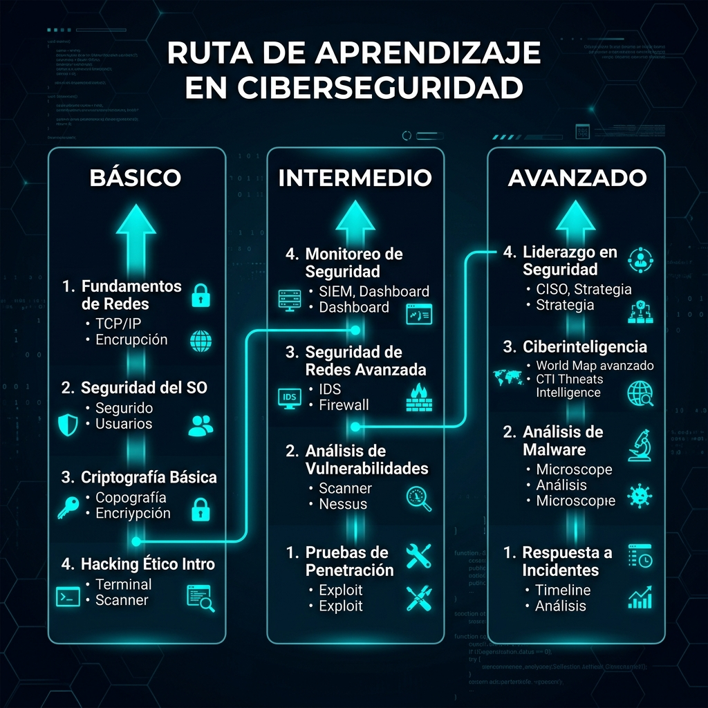

<p align="center">
  
</p>

<h1 align="center">🛡️ CIBER — Laboratorio de Ciberseguridad</h1>

<p align="center">
  <strong>De los fundamentos al Red Team — 37 proyectos prácticos de ciberseguridad en Python</strong>
</p>

<p align="center">
  <a href="#"></a>
  <a href="#"></a>
  <a href="#"></a>
  <a href="#"></a>
  <a href="#"></a>
  <a href="#"></a>
  <a href="#"></a>
</p>

<p align="center">
  <a href="#features">Features</a> •
  <a href="#roadmap-de-aprendizaje">Roadmap</a> •
  <a href="#proyectos">Proyectos</a> •
  <a href="#instalación">Instalación</a> •
  <a href="#arquitectura">Arquitectura</a> •
  <a href="#rendimiento">Rendimiento</a> •
  <a href="#wiki">Wiki</a> •
  <a href="#contribuir">Contribuir</a>
</p>

---

## 👤 Sobre Mí

```
┌─────────────────────────────────────────────────────────────────┐
│  $ whoami                                                       │
│                                                                 │
│  Lucas Méndez Díez                                              │
│  ─────────────────                                              │
│  Telecom & Cybersecurity Engineer                               │
│  FP Superior — Sistemas de Telecomunicaciones e Informáticos    │
│                                                                 │
│  $ cat skills.txt                                               │
│                                                                 │
│  [Lenguajes]   Python · Java · C/C++ · Bash                     │
│  [Redes]       Fibra Óptica · TCP/IP · VLAN · VPN · DNS        │
│  [Seguridad]   Red Team · Blue Team · Pentesting · OSINT        │
│  [Sistemas]    Linux · Windows Server · Virtualización          │
│  [Herramientas] Scapy · Paramiko · Cryptography · Metasploit   │
│                                                                 │
│  $ echo $STATUS                                                 │
│  Abierto a oportunidades en ciberseguridad                      │
└─────────────────────────────────────────────────────────────────┘
```

---

## Features

| Feature | Descripción |
|---------|-------------|
| **37 Proyectos Progresivos** | Desde cifrado básico hasta simulación Red Team completa |
| **3 Niveles de Dificultad** | Básico, Intermedio, Avanzado — ruta de aprendizaje estructurada |
| **Criptografía Aplicada** | Fernet → AES-256-CBC → AES-256-GCM con PBKDF2 |
| **Análisis de Red** | Scapy, sniffing, ARP, IDS, detección de intrusiones |
| **Red Team / C2** | Framework de explotación, simulación C2, pivoting |
| **Blue Team / Defensa** | HIDS, NIDS, Threat Hunting con MITRE ATT&CK |
| **Dashboards Interactivos** | HTML/JS + backend Python (SIEM, C2, honeypots, malware) |
| **SentinelX SOC** | Dashboard SOC completo con Next.js, Prisma y autenticación |
| **Wiki Técnica** | 40+ páginas con diagramas, código explicado y fundamentos |

---

## Roadmap de Aprendizaje



Este repositorio está organizado de menor a mayor complejidad. Cada proyecto construye sobre los conceptos del anterior, formando una ruta de aprendizaje completa:

```
NIVEL BÁSICO ──────► NIVEL INTERMEDIO ──────► NIVEL AVANZADO ──────► PROYECTOS FUTUROS (UI)
  Cifrado Fernet        AES-256 + PBKDF2         AES-256-GCM              Dashboards interactivos
  Socket TCP            Threading + Queue         C2 Framework             SIEM en tiempo real
  Hashing básico        Packet analysis           NIDS con flujos          Análisis IA de malware
  Log parsing           ARP Detection             Malware static lab       Red Team consola web
```

---

## Proyectos

### 🟢 Nivel Básico — Fundamentos

> **Objetivo**: Comprender cómo funcionan por dentro las herramientas de seguridad más comunes.

| # | Proyecto | Conceptos Clave | Dependencias |
|---|----------|-----------------|--------------|
| 01 | [Password Locker](ciberseguridad/nivel_basico/01_password_locker) | Cifrado simétrico Fernet, almacenamiento JSON | `cryptography` |
| 02 | [Port Scanner](ciberseguridad/nivel_basico/02_port_scanner) | Sockets TCP, handshake 3-way, puertos/servicios | `socket` (stdlib) |
| 03 | [Hash Cracker](ciberseguridad/nivel_basico/03_hash_cracker_simple) | MD5, SHA-256, ataque por diccionario | `hashlib` (stdlib) |
| 04 | [Log Analyzer](ciberseguridad/nivel_basico/04_log_analyzer) | Expresiones regulares, parsing de eventos | `re` (stdlib) |
| 05 | [File Integrity Checker](ciberseguridad/nivel_basico/05_file_integrity_checker) | Hashing de archivos, línea base de integridad | `hashlib`, `json` |
| 06 | [Keylogger Demo](ciberseguridad/nivel_basico/06_basic_keylogger_demo) | Hooks de teclado, eventos de entrada del SO | `pynput` |
| 07 | [Caesar Cipher](ciberseguridad/nivel_basico/07_caesar_cipher_tool) | Cifrado de sustitución, aritmética modular | stdlib |
| 08 | [Base64 Tool](ciberseguridad/nivel_basico/08_base64_encoder_decoder) | Codificación binario→texto, JWT, tokens | `base64` (stdlib) |
| 09 | [Vulnerability Scanner](ciberseguridad/nivel_basico/09_simple_vulnerability_scanner) | Cabeceras HTTP, CSP, HSTS, X-Frame-Options | `requests` |
| 10 | [Network Sniffer](ciberseguridad/nivel_basico/10_network_sniffer_basico) | Captura de paquetes, modo promiscuo, L3/L4 | `scapy` |

### 🟡 Nivel Intermedio — Automatización y Detección

> **Objetivo**: Implementar herramientas multihilo, análisis de protocolos de red y primeros sistemas defensivos.

| # | Proyecto | Conceptos Clave | Dependencias |
|---|----------|-----------------|--------------|
| 01 | [Password Locker v2](ciberseguridad/nivel_intermedio/01_password_locker_mejorado) | AES-256 CBC, PBKDF2 con sal, categorías | `cryptography` |
| 02 | [Multithreaded Port Scanner](ciberseguridad/nivel_intermedio/02_multithreaded_port_scanner) | Threading, Queue, concurrencia segura | `threading`, `queue` |
| 03 | [Directory Bruteforcer](ciberseguridad/nivel_intermedio/03_directory_bruteforcer) | HTTP status codes, wordlists, session pooling | `requests`, `threading` |
| 04 | [Web Login Bruteforce](ciberseguridad/nivel_intermedio/04_web_login_bruteforce) | POST forms, cookies, detección de éxito | `requests` |
| 05 | [Packet Sniffer Avanzado](ciberseguridad/nivel_intermedio/05_packet_sniffer_avanzado) | Deep packet inspection, credenciales en texto plano | `scapy` |
| 06 | [ARP Spoofer Detector](ciberseguridad/nivel_intermedio/06_arp_spoofer_detector) | Protocolo ARP, MITM, tablas MAC/IP | `scapy` |
| 07 | [Basic IDS System](ciberseguridad/nivel_intermedio/07_basic_ids_system) | SYN Flood, ICMP Flood, ventanas temporales | `scapy`, `collections` |
| 08 | [Web Vuln Scanner](ciberseguridad/nivel_intermedio/08_web_vulnerability_scanner) | XSS reflejado, error-based SQLi, cabeceras | `requests`, `bs4` |
| 09 | [SSH Bruteforce](ciberseguridad/nivel_intermedio/09_ssh_bruteforce_tool) | Protocolo SSH, autenticación, Paramiko | `paramiko`, `threading` |
| 10 | [Log Monitor System](ciberseguridad/nivel_intermedio/10_log_monitoring_system) | Tail -f en Python, correlación, umbrales | `re`, `threading` |

### 🔴 Nivel Avanzado — Red Team / Blue Team

> **Objetivo**: Simular operaciones reales de ataque y defensa con frameworks, detección y evasión.

| # | Proyecto | Conceptos Clave | Dependencias |
|---|----------|-----------------|--------------|
| 01 | [Custom C2 Simulator](ciberseguridad/nivel_avanzado/01_custom_c2_simulator) | HTTP Polling, agentes, encolado de tareas, exfiltración | `flask`, `requests` |
| 02 | [Mini Metasploit](ciberseguridad/nivel_avanzado/02_mini_metasploit_like_tool) | Arquitectura modular, payloads, consola interactiva | stdlib |
| 03 | [Advanced Password Manager](ciberseguridad/nivel_avanzado/03_advanced_password_manager) | AES-256-GCM (AEAD), PBKDF2 600K iter., auditoría | `cryptography` |
| 04 | [Network IDS (NIDS)](ciberseguridad/nivel_avanzado/04_network_intrusion_detection_system) | Análisis de flujos, Threat Intelligence, IOCs | `scapy`, `json` |
| 05 | [Web Pentesting Framework](ciberseguridad/nivel_avanzado/05_web_app_pentesting_framework) | Reconocimiento, fingerprinting, SSL audit, reportes | `requests`, `ssl` |
| 06 | [Privilege Escalation Lab](ciberseguridad/nivel_avanzado/06_privilege_escalation_lab) | SUID, cron jobs, PATH hijacking, kernel exploits | `os`, `subprocess` |
| 07 | [Malware Analysis Lab](ciberseguridad/nivel_avanzado/07_malware_analysis_lab) | Entropía Shannon, strings estáticos, IOCs, PE headers | `math`, `re` |
| 08 | [Ransomware Simulator](ciberseguridad/nivel_avanzado/08_ransomware_simulator_controlled) | AES-256 CFB, cifrado de directorios, recuperación | `cryptography` |
| 09 | [Threat Hunting Lab](ciberseguridad/nivel_avanzado/09_threat_hunting_lab) | MITRE ATT&CK, correlación, IOCs, Sysmon events | `re`, `json` |
| 10 | [Red Team Lab](ciberseguridad/nivel_avanzado/10_red_team_lab_simulation) | Recon → Exploit → Pivot → Exfil → Report | múltiples |

### 🛸 Proyecto Estrella: SentinelX SOC Dashboard

> Panel de Control de Ciberseguridad (SOC) construido con Next.js, Prisma y autenticación segura.

| Componente | Tecnología |
|------------|-----------|
| Frontend | Next.js 14, React, TypeScript |
| Backend | Next.js API Routes, Prisma ORM |
| Base de Datos | SQLite (dev) / PostgreSQL (prod) |
| Autenticación | NextAuth.js con credenciales seguras |
| UI/UX | Tailwind CSS, componentes responsivos |
| Charts | Chart.js para visualización de datos |

[Ver documentación completa →](SentinelX/README.md)

### 🚀 Proyectos Futuros — Dashboards Interactivos

> **Objetivo**: Visualizar operaciones de seguridad mediante interfaces web interactivas.

| # | Dashboard Visual | Backend CLI Python |
|---|------------------|--------------------|
| 01 | [Simulador APT](ciberseguridad/proyectos_futuros/01_simulador_apt) | Consola C2 con nodos, terminal y beacon logs |
| 02 | [Analizador Malware IA](ciberseguridad/proyectos_futuros/02_analizador_malware_ia) | Gauge de amenaza, entropía, APIs sospechosas |
| 03 | [Red Team Framework](ciberseguridad/proyectos_futuros/03_red_team_framework) | Consola de exploits estilo Metasploit |
| 04 | [SIEM Dashboard](ciberseguridad/proyectos_futuros/04_siem_dashboard) | Monitor de logs en tiempo real con alertas |
| 05 | [Honeypots Interactivos](ciberseguridad/proyectos_futuros/05_honeypots_interactivos) | Mapa de ataques live + capturas de credenciales |
| 06 | [Phishing Manager](ciberseguridad/proyectos_futuros/06_phishing_manager) | Gestor de campañas con plantillas |
| 07 | [Mapeador Superficie Ataque](ciberseguridad/proyectos_futuros/07_mapeador_superficie_ataque) | Topología de red con sonar de reconocimiento |

---

## Instalación

### Prerrequisitos

- **Python** 3.10 o superior
- **Git** 2.30+
- **Node.js** 18+ (solo para SentinelX)
- **Scapy** requiere permisos de administrador en proyectos de red

### Clonar e instalar

```bash
git clone https://github.com/lucasmdg/CIBER.git
cd CIBER

python -m venv .venv
source .venv/bin/activate        # Linux/Mac
.venv\Scripts\activate           # Windows

pip install -r ciberseguridad/requirements.txt
```

### Verificar instalación

```bash
cd ciberseguridad
python run_tests.py
# Resultado esperado: 29/29 proyectos pasaron ✓
```

### SentinelX

```bash
cd SentinelX
npm install
npx prisma generate
npx prisma db push
npm run dev
```

---

## Arquitectura

```
CIBER/
├── ciberseguridad/           # Proyectos Python de ciberseguridad
│   ├── nivel_basico/         # 10 proyectos fundamentales
│   ├── nivel_intermedio/     # 10 proyectos de automatización
│   ├── nivel_avanzado/       # 10 proyectos Red/Blue Team
│   ├── proyectos_futuros/    # 7 dashboards interactivos
│   ├── pruebas_claude/       # Tests internos
│   ├── run_tests.py          # Suite de tests unificada
│   └── requirements.txt      # Dependencias Python
├── SentinelX/                # SOC Dashboard (Next.js)
│   ├── src/                  # Código fuente
│   ├── prisma/               # Esquema de base de datos
│   └── package.json
├── sentinel-cli/             # CLI de SentinelX
├── wiki/                     # Documentación GitHub Wiki
├── assets/                   # Imágenes y recursos
├── .github/                  # Templates y workflows CI
├── README.md
└── LICENSE
```

### Pipeline de Aprendizaje

```
┌──────────────┐    ┌──────────────┐    ┌──────────────┐    ┌──────────────┐
│  Fundamentals │───▶│  Automation  │───▶│  Red/Blue    │───▶│  Dashboards  │
│  (Básico)     │    │  (Intermedio)│    │  (Avanzado)  │    │  (Futuro)    │
└──────────────┘    └──────────────┘    └──────────────┘    └──────────────┘
       │                   │                   │                    │
       ▼                   ▼                   ▼                    ▼
  Cifrado Fernet      AES-256+PBKDF2      AES-256-GCM          UI/UX real
  Sockets TCP         Threading           C2 Framework         SIEM tiempo real
  Hashing básico      Packet analysis     NIDS con flujos       Análisis IA
  Log parsing         ARP Detection       Malware static        Consola web
```

---

## Tecnologías

| Categoría | Tecnologías |
|-----------|-------------|
| **Lenguajes** | Python 3.10+, TypeScript, Bash |
| **Criptografía** | `cryptography` (Fernet, AES-256-CBC, AES-256-GCM, PBKDF2) |
| **Redes** | `scapy`, `socket`, `requests`, `paramiko` |
| **Web** | `flask`, `bs4`, Next.js 14, Prisma, Tailwind CSS |
| **Testing** | `pytest`, `unittest` |
| **Herramientas** | Scapy, Paramiko, Metasploit (conceptual) |

---

## Rendimiento

| Proyecto | Tiempo de Ejecución | Consumo RAM |
|----------|--------------------|-------------|
| Password Locker | < 100ms | ~20 MB |
| Port Scanner (100 puertos) | ~2s | ~30 MB |
| Hash Cracker (10K palabras) | ~500ms | ~40 MB |
| C2 Simulator | Tiempo real | ~80 MB |
| NIDS (análisis en vivo) | Tiempo real | ~150 MB |
| SentinelX Dashboard | < 1s carga | ~200 MB |

---

## Consideraciones de Seguridad

- **Todos los proyectos son educativos** — no deben usarse en producción sin auditoría
- Las herramientas de red requieren **entornos controlados** y autorización explícita
- SentinelX usa NextAuth.js con **credenciales hasheadas** — configurar en producción con HTTPS
- No se almacenan contraseñas reales — solo hashes PBKDF2 con 600,000 iteraciones
- Los proyectos de red (Scapy) deben ejecutarse con **permisos de administrador**
- **Marco legal**: El uso no autorizado de estas herramientas puede constituir delito (Art. 264 CP España)

---

## Wiki

La [Wiki del repositorio](https://github.com/lucasmdg/CIBER/wiki) contiene documentación completa:

| Sección | Páginas |
|---------|---------|
| **General** | [Home](wiki/Home.md), [Instalación](wiki/Installation.md), [Quick Start](wiki/Quick-Start.md), [Arquitectura](wiki/Architecture.md) |
| **Básico** | Password Locker, Port Scanner, Hash Cracker, Log Analyzer, FIC, Keylogger, Caesar, Base64, Vuln Scanner, Sniffer |
| **Intermedio** | PW Locker v2, MT Port Scanner, Dir Bruteforcer, Login Bruteforce, Packet Sniffer, ARP Detector, IDS, Web Vuln, SSH, Log Monitor |
| **Avanzado** | C2, Mini Metasploit, Advanced PW, NIDS, Pentesting, PrivEsc, Malware Lab, Ransomware, Threat Hunting, Red Team |
| **SentinelX** | Introducción, Arquitectura, Instalación, Módulos, Seguridad, DevSecOps, Roadmap |
| **Guías** | [Desarrollo](wiki/Development.md), [Testing](wiki/Testing.md), [Contribuir](wiki/Contributing.md), [FAQ](wiki/FAQ.md), [Troubleshooting](wiki/Troubleshooting.md) |

---

## FAQ

**¿Puedo usar estas herramientas en sistemas reales?**
Solo en entornos controlados con autorización explícita. El uso no autorizado es ilegal.

**¿Necesito conocimientos previos?**
Se recomienda conocer Python básico. Los proyectos nivel básico enseñan los fundamentos.

**¿Funciona en Windows?**
Sí, aunque los proyectos de red (Scapy) funcionan mejor en Linux o WSL2.

**¿Cómo ejecuto todos los tests?**
```bash
cd ciberseguridad
python run_tests.py
```

**¿Cómo contribuyo?**
Revisa la [Guía de Contribución](CONTRIBUTING.md) y el [Código de Conducta](CODE_OF_CONDUCT.md).

---

## Contribuir

Las contribuciones son bienvenidas. Por favor:

1. Revisa los [issues abiertos](https://github.com/lucasmdg/CIBER/issues)
2. Lee la [Guía de Contribución](CONTRIBUTING.md)
3. Sigue el [Código de Conducta](CODE_OF_CONDUCT.md)
4. Abre un PR con tus cambios

---

## Licencia

Distribuido bajo **MIT License**. Ver [LICENSE](LICENSE).

---

## Contacto

**Lucas Méndez Díez** — Telecom & Cybersecurity Engineer

[](https://github.com/lucasmdg)

---

<p align="center">
  <strong>Educación · Seguridad · Responsabilidad</strong><br>
  <sub>Todo el contenido tiene fines exclusivamente educativos. Usa este conocimiento de forma ética.</sub>
</p>
