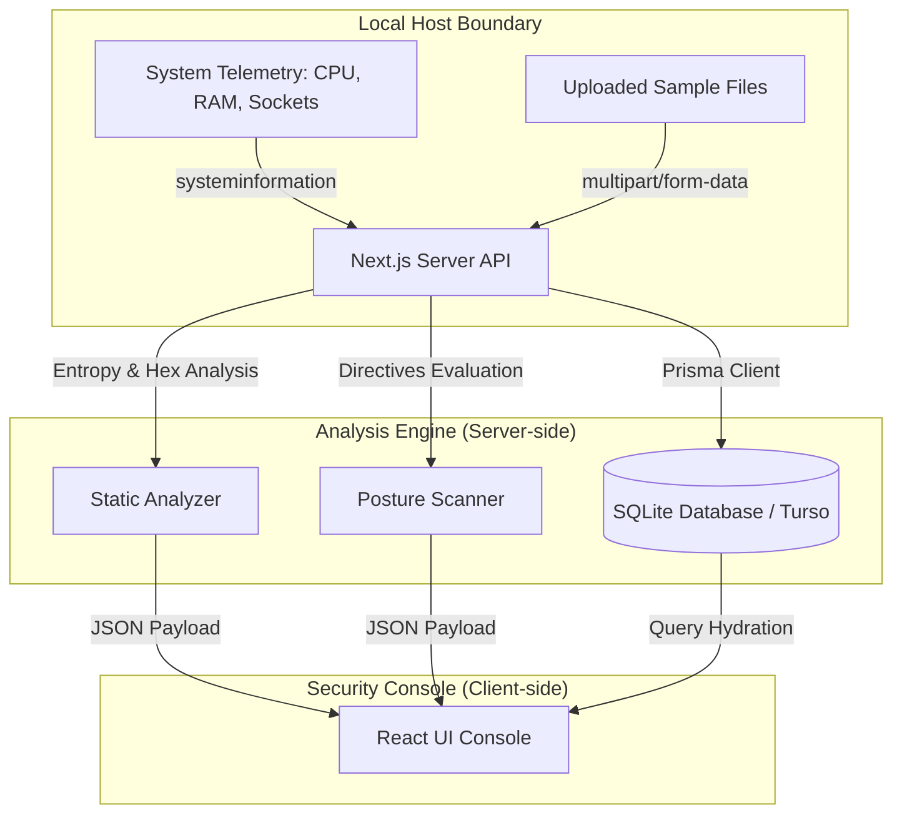

# SentinelX — Defensive Cyber Security Operations Dashboard

[](https://github.com/lucasmdg/CIBER/actions/workflows/ci-sentinelx.yml)
[](LICENSE)
[](SECURITY.md)

SentinelX is a defensive, educational Security Operations Center (SOC) dashboard built with Next.js 14, TypeScript, TailwindCSS, and Prisma. It is designed to run locally, gathering system telemetry, performing static analysis on files, and providing simulated attack path simulations.

---

## 🏗️ Architecture & Data Flow

The system runs entirely within a local boundary. The following diagram illustrates the data gathering, analysis, and rendering pipeline:



---

## 🛠️ Tech Stack

- **Framework**: Next.js 14 (App Router)
- **Language**: TypeScript (Strict Mode compiler settings verified)
- **Database ORM**: Prisma Client (SQLite local database file)
- **Testing**: Vitest (Unit & Integration)
- **Aesthetics**: Vanilla TailwindCSS + custom utility classes for glassmorphism and real-time state telemetry overlays

---

## 🚦 System Capabilities & Verification

The project is structured with a strict **Security by Design** perspective:
1. **Host Telemetry**: Collects active TCP/UDP connection maps, speed states, and local network interface details using the `systeminformation` library.
2. **Posture Scanning**: Safely probes headers of the local host. An `AbortController` handles manual scan cancellation to prevent UI thread lockups.
3. **Static File Analyzer**: Extracts MD5 and SHA-256 hashes, calculates Shannon Entropy to detect packed/encrypted payloads, parse PE (Portable Executable) headers, and reports suspicious strings without executing binary instructions.

---

## ⚠️ Known Limitations

- **No Active Network Probing**: SentinelX only probes loopback or RFC1918 local addresses. Outbound malicious port scanning is restricted.
- **Static Analysis Depth**: The static analyzer parses files up to 10 MB in memory. It does not perform dynamic analysis, virtualization, or kernel-level sandbox execution.
- **SQLite Database**: Designed for local execution. In production environments, replace it with a PostgreSQL backend (Turso/PostgreSQL schemas are compatible).

---

## 🚀 Local Development

Follow these steps to run SentinelX on your machine:

1. **Clone the Repository**:
   ```bash
   git clone https://github.com/lucasmdg/CIBER.git
   cd CIBER/SentinelX
   ```

2. **Configure Environment Variables**:
   ```bash
   cp .env.example .env
   ```

3. **Install Dependencies & Generate Schema**:
   ```bash
   npm install
   npx prisma generate
   npx prisma db push
   ```

4. **Seed Database Records**:
   ```bash
   npx tsx prisma/seed.ts
   npx tsx prisma/seed-users.ts
   ```

5. **Run the Development Server**:
   ```bash
   npm run dev
   ```

6. **Credentials for local testing**:
   - **Analyst**: `analyst@sentinelx.local` / `SentinelX-Demo-2026`
   - **Engineer**: `engineer@sentinelx.local` / `SentinelX-Demo-2026`
   - **Admin**: `admin@sentinelx.local` / `SentinelX-Demo-2026`

---

## 🧪 Testing Suite

Run the full testing verification suite:
```bash
npm run typecheck   # Runs strict TypeScript validation
npm test            # Runs unit tests (Vitest)
```
