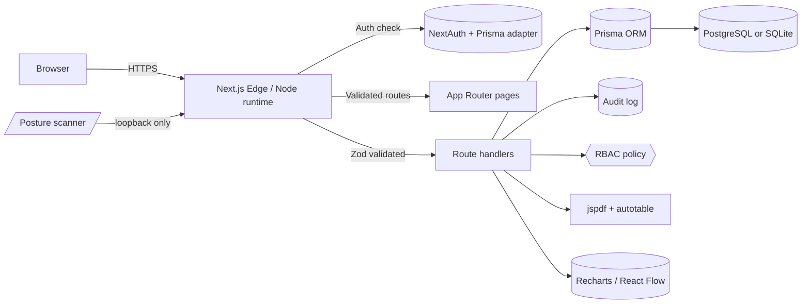

# SentinelX — Architecture

## 1. High-level diagram

## 2. Module map

| Module | Path | Purpose |
| --- | --- | --- |
| Executive dashboard | `app/(dashboard)/dashboard/page.tsx` | KPIs, trends, heatmap, severity pie, compliance |
| Asset inventory | `app/(dashboard)/assets/page.tsx` | CRUD, search, filter |
| Vulnerability management | `app/(dashboard)/vulnerabilities/page.tsx` | Search, sort, filter, trends |
| Threat intel | `app/(dashboard)/threats/page.tsx` | Actors, malware, MITRE coverage |
| Posture scanner | `app/(dashboard)/posture/page.tsx` | Loopback-only header checks |
| Attack paths | `app/(dashboard)/attack-paths/page.tsx` | React Flow kill-chain graphs |
| Incidents | `app/(dashboard)/incidents/page.tsx` | NIST IR phase timeline |
| Reports | `app/(dashboard)/reports/page.tsx` | Branded PDF exports |

## 3. Data model

The Prisma schema (`prisma/schema.prisma`) defines:

- `User`, `Account`, `Session`, `VerificationToken` (NextAuth)
- `Asset` ? `Vulnerability` (many-to-many via `Finding`)
- `ThreatActor`, `Malware`
- `PostureCheck`, `AttackPath`
- `Incident` 1–n `IncidentEvent`
- `AuditLog`

## 4. Security model

- **Authentication** — NextAuth Credentials with bcrypt-hashed passwords.
- **Authorization** — RBAC matrix in `lib/rbac/roles.ts` (`viewer`, `analyst`, `engineer`, `admin`).
- **Validation** — Zod schemas in `lib/security/validation.ts`.
- **Output encoding** — `lib/security/sanitize.ts` helpers; React auto-escapes JSX.
- **Rate limiting** — In-memory token bucket in `lib/security/rate-limit.ts` and `middleware.ts`.
- **Audit logging** — `lib/audit/logger.ts` writes to the `AuditLog` table.
- **Headers** — CSP, HSTS, X-Frame-Options, Referrer-Policy, Permissions-Policy via `next.config.mjs`.

## 5. Deployment

- Container image is multi-stage and runs as a non-root user.
- Postgres profile available in `docker-compose.yml`.
- Healthcheck hits `/`.
- Secrets injected at runtime via env vars; `.env.example` documents the contract.
