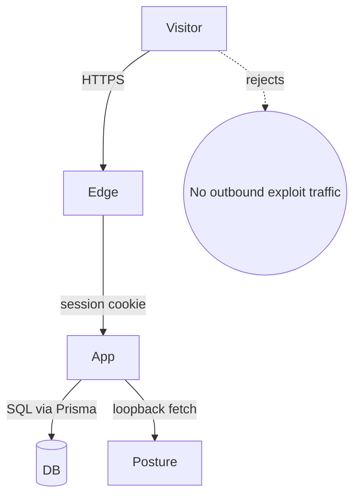

# Threat Model

This document captures SentinelX's defensive threat model. It is intentionally
short and pragmatic: the project is a **defensive** SOC demo, so the focus is
on what could go wrong inside the dashboard itself.

## 1. Assets

- Synthetic data set (assets, vulnerabilities, threats, incidents).
- User credentials (bcrypt-hashed) for the demo accounts.
- Audit log records.
- Optional PostgreSQL connection string.

## 2. Trust boundaries

## 3. STRIDE summary

| Category | Threat | Mitigation |
| --- | --- | --- |
| **Spoofing** | Cookie / session theft | NextAuth signed JWT, HttpOnly + SameSite cookies, short TTL (8h) |
| **Tampering** | Unsanitised user input | Zod validation, parameterized Prisma, output encoding |
| **Repudiation** | "Who did what?" | `AuditLog` table for every write path |
| **Information disclosure** | Sensitive headers / paths leaking | CSP, HSTS, X-Frame-Options, Referrer-Policy |
| **Denial of service** | Brute force / flooding | Per-IP rate limiter, Zod length caps |
| **Elevation of privilege** | RBAC bypass | Server-side `can()` checks on every mutation |

## 4. Out-of-scope threats

- Off-target scanning, exploitation, phishing. The Posture scanner is
  restricted to loopback / RFC1918 by `postureScanRequestSchema`.
- Real user data collection. The system never reaches out to any production
  asset during a demo.
- Supply-chain compromise. Mitigated by Dependabot, npm audit, CodeQL, and
  gitleaks.

## 5. Residual risk

A demo system is **not** a production control plane. Run the project behind
SSO in a real environment, replace the seeded credentials, switch to
PostgreSQL, and remove the public demo mode (`robots: noindex,nofollow`) before
exposing it externally.
