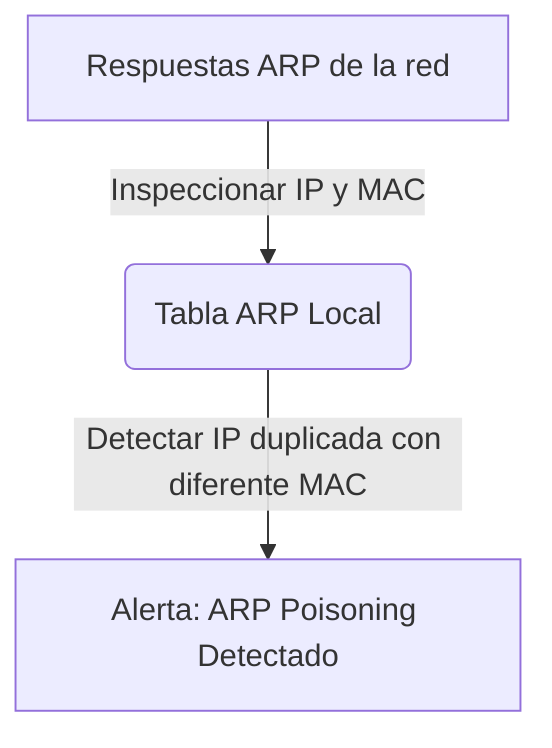

# ARP Spoofer Detector

<span style="background-color: #2ea44f; color: white; padding: 4px 8px; border-radius: 4px; font-weight: bold;">Nivel Intermedio</span>

## 📝 Descripción
Monitoriza el tráfico ARP en tiempo real y detecta ataques de ARP Poisoning comparando MACs.

## 🛠️ Arquitectura y Flujo de Datos


## 🧠 Explicación Técnica y Conceptos Clave
El protocolo ARP no tiene estado ni autenticación, lo que permite a los atacantes enviar paquetes de respuesta falsos para asociar su MAC a la IP del gateway (ARP Spoofing). Este script guarda una relación IP-MAC y monitoriza el tráfico; si una dirección IP empieza a reclamar una MAC diferente en periodos cortos de tiempo, se dispara una alerta.

## 💻 Código de Ejemplo o Estructura Lógica
```python
def process_arp_packet(pkt):
    if pkt.haslayer('ARP') and pkt['ARP'].op == 2: # is-at (respuesta)
        # Comparar MAC origen contra MAC real de la IP
        pass
```

## 🔗 Código Fuente y Acceso en GitHub
Puedes ver la implementación completa del código y probar este script directamente accediendo a su carpeta de proyecto:
[Ver código en GitHub](https://github.com/lucasmdg/CIBER/tree/main/ciberseguridad/nivel_intermedio/06_arp_spoofer_detector)
