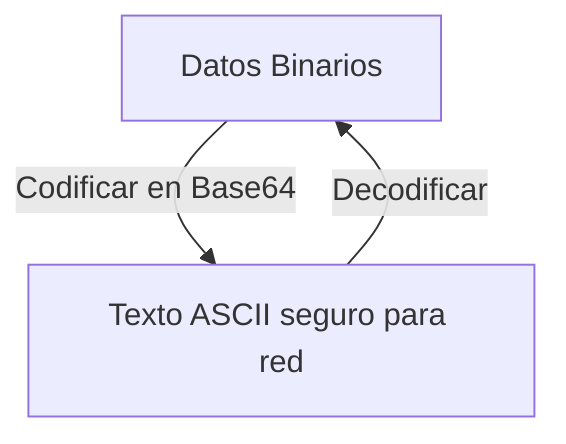

# Base64 Encoder/Decoder

<span style="background-color: #2ea44f; color: white; padding: 4px 8px; border-radius: 4px; font-weight: bold;">Nivel Básico</span>

## 📝 Descripción
Herramienta para codificar y decodificar datos en Base64, formato usado en tokens JWT, emails y más.

## 🛠️ Arquitectura y Flujo de Datos


## 🧠 Explicación Técnica y Conceptos Clave
Base64 no es un algoritmo de cifrado, sino un esquema de codificación binaria a texto. Diseñado para transportar datos binarios sobre canales que solo admiten texto (como el correo electrónico o las URL), traduce bloques de 3 bytes en bloques de 4 caracteres ASCII.

## 💻 Código de Ejemplo o Estructura Lógica
```python
import base64

def encode_data(data):
    return base64.b64encode(data.encode()).decode()

def decode_data(encoded):
    return base64.b64decode(encoded.encode()).decode()
```

## 🔗 Código Fuente y Acceso en GitHub
Puedes ver la implementación completa del código y probar este script directamente accediendo a su carpeta de proyecto:
[Ver código en GitHub](https://github.com/lucasmdg/CIBER/tree/main/ciberseguridad/nivel_basico/08_base64_encoder_decoder)
