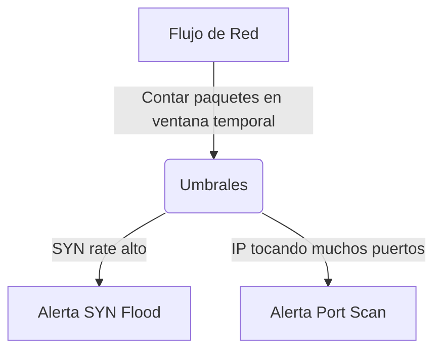

# Basic IDS System

<span style="background-color: #2ea44f; color: white; padding: 4px 8px; border-radius: 4px; font-weight: bold;">Nivel Intermedio</span>

## 📝 Descripción
Sistema de Detección de Intrusiones que identifica port scans, SYN floods e ICMP floods en la red.

## 🛠️ Arquitectura y Flujo de Datos


## 🧠 Explicación Técnica y Conceptos Clave
Este Sistema de Detección de Intrusiones (IDS) de red monitoriza métricas estadísticas de tráfico. Si el número de paquetes SYN (petición de conexión) procedentes de una sola IP supera un límite de tiempo razonable, clasifica el evento como un ataque de denegación de servicio SYN Flood o un Port Scan.

## 💻 Código de Ejemplo o Estructura Lógica
```python
from collections import defaultdict
import time

conn_attempts = defaultdict(list)
def detect_syn_flood(src_ip):
    now = time.time()
    conn_attempts[src_ip] = [t for t in conn_attempts[src_ip] if now - t < 10]
    conn_attempts[src_ip].append(now)
    if len(conn_attempts[src_ip]) > 100:
        print(f"Alerta: SYN Flood de {src_ip}")
```

## 🔗 Código Fuente y Acceso en GitHub
Puedes ver la implementación completa del código y probar este script directamente accediendo a su carpeta de proyecto:
[Ver código en GitHub](https://github.com/lucasmdg/CIBER/tree/main/ciberseguridad/nivel_intermedio/07_basic_ids_system)
