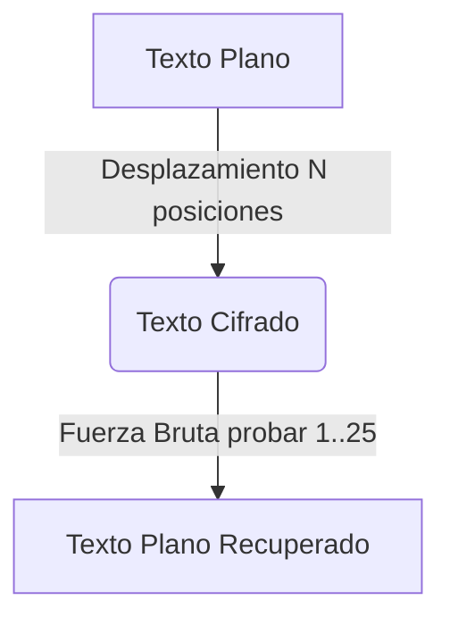

# Caesar Cipher Tool

<span style="background-color: #2ea44f; color: white; padding: 4px 8px; border-radius: 4px; font-weight: bold;">Nivel Básico</span>

## 📝 Descripción
Implementación del cifrado César con cifrado, descifrado y fuerza bruta para romperlo.

## 🛠️ Arquitectura y Flujo de Datos


## 🧠 Explicación Técnica y Conceptos Clave
El cifrado César es uno de los algoritmos criptográficos más antiguos y sencillos. Es un tipo de cifrado por sustitución en el que una letra en el texto original es reemplazada por otra letra que se encuentra un número fijo de posiciones más adelante en el alfabeto. Es fácilmente vulnerable a ataques de fuerza bruta debido al número limitado de claves posibles (25 en el alfabeto inglés).

## 💻 Código de Ejemplo o Estructura Lógica
```python
def caesar_cipher(text, shift, mode='encrypt'):
    result = ""
    for char in text:
        if char.isalpha():
            start = ord('A') if char.isupper() else ord('a')
            offset = shift if mode == 'encrypt' else -shift
            result += chr((ord(char) - start + offset) % 26 + start)
        else:
            result += char
    return result
```

## 🔗 Código Fuente y Acceso en GitHub
Puedes ver la implementación completa del código y probar este script directamente accediendo a su carpeta de proyecto:
[Ver código en GitHub](https://github.com/lucasmdg/CIBER/tree/main/ciberseguridad/nivel_basico/07_caesar_cipher_tool)
