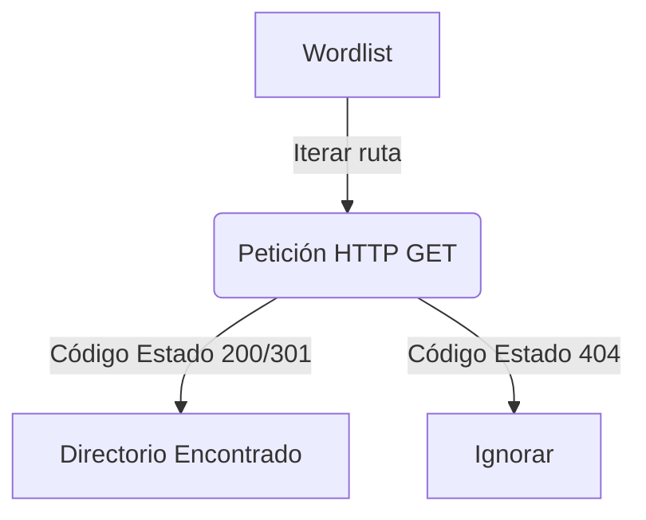

# Directory Bruteforcer

<span style="background-color: #2ea44f; color: white; padding: 4px 8px; border-radius: 4px; font-weight: bold;">Nivel Intermedio</span>

## 📝 Descripción
Descubrimiento de rutas ocultas en servidores web mediante fuerza bruta con diccionario.

## 🛠️ Arquitectura y Flujo de Datos


## 🧠 Explicación Técnica y Conceptos Clave
Este script imita herramientas como Gobuster u Dirbuster. Realiza peticiones HTTP concurrentes probando nombres de carpetas y archivos comunes a partir de una lista de palabras (wordlist). Si el servidor responde con códigos 200 (OK) o 301/302 (Redirección), se reporta el recurso web como existente.

## 💻 Código de Ejemplo o Estructura Lógica
```python
import requests

def check_dir(base_url, directory):
    url = f"{base_url}/{directory}"
    r = requests.get(url)
    if r.status_code == 200:
        print(f"Encontrado: {url}")
```

## 🔗 Código Fuente y Acceso en GitHub
Puedes ver la implementación completa del código y probar este script directamente accediendo a su carpeta de proyecto:
[Ver código en GitHub](https://github.com/lucasmdg/CIBER/tree/main/ciberseguridad/nivel_intermedio/03_directory_bruteforcer)
