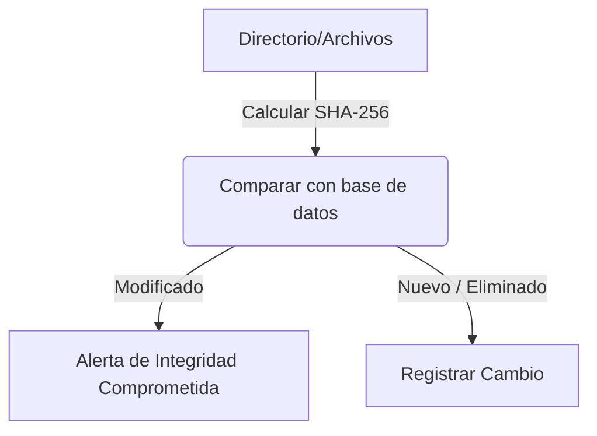

# File Integrity Checker

<span style="background-color: #2ea44f; color: white; padding: 4px 8px; border-radius: 4px; font-weight: bold;">Nivel Básico</span>

## 📝 Descripción
Verifica la integridad de archivos comparando hashes SHA-256 contra una línea base conocida.

## 🛠️ Arquitectura y Flujo de Datos


## 🧠 Explicación Técnica y Conceptos Clave
Un verificador de integridad de archivos (FIM) asegura que los archivos críticos del sistema no hayan sido alterados por atacantes o malware. Funciona creando una base de datos inicial con los hashes criptográficos (SHA-256) de los archivos sanos y verificándolos periódicamente.

## 💻 Código de Ejemplo o Estructura Lógica
```python
import hashlib
import os

def calculate_sha256(filepath):
    sha256 = hashlib.sha256()
    with open(filepath, 'rb') as f:
        while chunk := f.read(8192):
            sha256.update(chunk)
    return sha256.hexdigest()
```

## 🔗 Código Fuente y Acceso en GitHub
Puedes ver la implementación completa del código y probar este script directamente accediendo a su carpeta de proyecto:
[Ver código en GitHub](https://github.com/lucasmdg/CIBER/tree/main/ciberseguridad/nivel_basico/05_file_integrity_checker)
