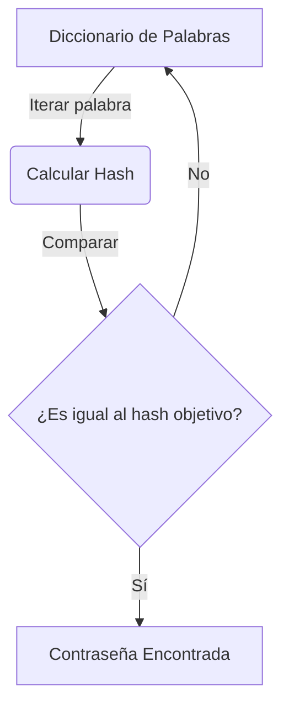

# Hash Cracker

<span style="background-color: #2ea44f; color: white; padding: 4px 8px; border-radius: 4px; font-weight: bold;">Nivel Básico</span>

## 📝 Descripción
Cracker de hashes MD5 y SHA-256 por diccionario. Demuestra por qué las contraseñas débiles son peligrosas.

## 🛠️ Arquitectura y Flujo de Datos


## 🧠 Explicación Técnica y Conceptos Clave
Este script implementa un ataque de diccionario offline contra hashes MD5 o SHA-256. Demuestra la importancia de usar funciones de derivación de claves lentas (como PBKDF2 o bcrypt) con sal (salt), ya que los hashes rápidos simples pueden romperse rápidamente si la contraseña se encuentra en un diccionario común.

## 💻 Código de Ejemplo o Estructura Lógica
```python
import hashlib

def crack_hash(target_hash, wordlist_path):
    with open(wordlist_path, 'r') as f:
        for word in f.read().splitlines():
            hashed_word = hashlib.sha256(word.encode()).hexdigest()
            if hashed_word == target_hash:
                return f"Éxito: {word}"
    return "No encontrado" 
```

## 🔗 Código Fuente y Acceso en GitHub
Puedes ver la implementación completa del código y probar este script directamente accediendo a su carpeta de proyecto:
[Ver código en GitHub](https://github.com/lucasmdg/CIBER/tree/main/ciberseguridad/nivel_basico/03_hash_cracker_simple)
