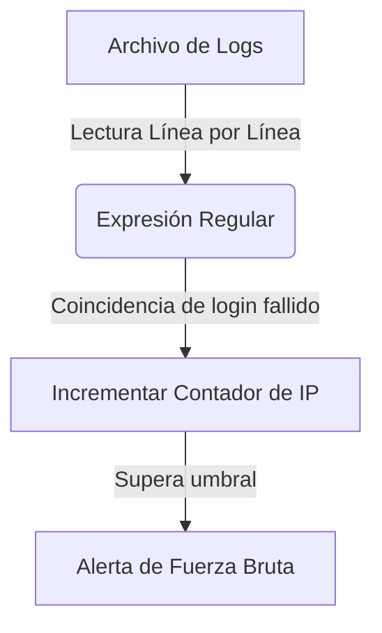

# Log Analyzer

<span style="background-color: #2ea44f; color: white; padding: 4px 8px; border-radius: 4px; font-weight: bold;">Nivel Básico</span>

## 📝 Descripción
Analizador de archivos de log que detecta patrones sospechosos como intentos de login fallidos.

## 🛠️ Arquitectura y Flujo de Datos


## 🧠 Explicación Técnica y Conceptos Clave
Los archivos de log son la principal fuente de telemetría para la detección de incidentes. Este analizador automatiza la inspección de registros (como `/var/log/auth.log` o logs de Apache) usando expresiones regulares (`regex`) para encontrar eventos sospechosos como fallos de autenticación repetidos desde una misma IP.

## 💻 Código de Ejemplo o Estructura Lógica
```python
import re
from collections import Counter

def analyze_logs(log_file):
    failed_ips = []
    pattern = re.compile(r"Failed password for.*from (\d{1,3}\.\d{1,3}\.\d{1,3}\.\d{1,3})")
    with open(log_file, 'r') as f:
        for line in f:
            match = pattern.search(line)
            if match:
                failed_ips.append(match.group(1))
    return Counter(failed_ips)
```

## 🔗 Código Fuente y Acceso en GitHub
Puedes ver la implementación completa del código y probar este script directamente accediendo a su carpeta de proyecto:
[Ver código en GitHub](https://github.com/lucasmdg/CIBER/tree/main/ciberseguridad/nivel_basico/04_log_analyzer)
