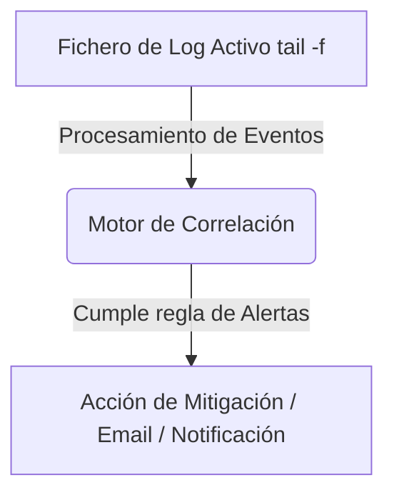

# Log Monitoring System

<span style="background-color: #2ea44f; color: white; padding: 4px 8px; border-radius: 4px; font-weight: bold;">Nivel Intermedio</span>

## 📝 Descripción
Sistema de monitorización de logs en tiempo real con reglas de detección, umbrales y ventanas temporales.

## 🛠️ Arquitectura y Flujo de Datos


## 🧠 Explicación Técnica y Conceptos Clave
A diferencia de un análisis estático de logs, este sistema realiza un seguimiento continuo (estilo `tail -f`) sobre un archivo de eventos. Implementa un motor con memoria de estado interno que correlaciona sucesos en un marco temporal (p. ej. alertar si hay más de 5 errores HTTP 500 en menos de 2 minutos).

## 💻 Código de Ejemplo o Estructura Lógica
```python
import time

def follow_log(filename):
    with open(filename, 'r') as f:
        f.seek(0, 2) # Ir al final del archivo
        while True:
            line = f.readline()
            if not line:
                time.sleep(0.1)
                continue
            yield line
```

## 🔗 Código Fuente y Acceso en GitHub
Puedes ver la implementación completa del código y probar este script directamente accediendo a su carpeta de proyecto:
[Ver código en GitHub](https://github.com/lucasmdg/CIBER/tree/main/ciberseguridad/nivel_intermedio/10_log_monitoring_system)
