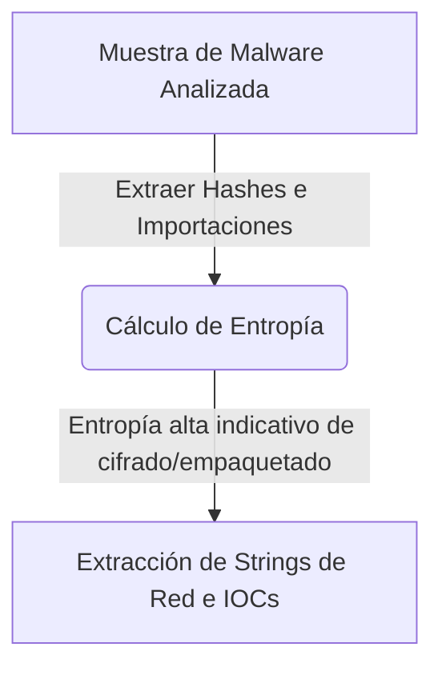

# Malware Analysis Lab

<span style="background-color: #2ea44f; color: white; padding: 4px 8px; border-radius: 4px; font-weight: bold;">Nivel Avanzado</span>

## 📝 Descripción
Análisis estático: hashes, entropía de Shannon, extracción de strings y detección automática de IOCs.

## 🛠️ Arquitectura y Flujo de Datos


## 🧠 Explicación Técnica y Conceptos Clave
El análisis estático de malware desglosa los binarios sin llegar a ejecutarlos. Esta herramienta calcula la Entropía de Shannon (indicando si la muestra está empaquetada o cifrada para evadir antivirus), extrae strings imprimibles del archivo (revelando IPs de atacantes, dominios de C2 o llamadas a APIs sospechosas) y busca firmas y hashes de IOCs (Indicadores de Compromiso) conocidos.

## 💻 Código de Ejemplo o Estructura Lógica
```python
import math
from collections import Counter

def shannon_entropy(data):
    # Calcula la entropía del archivo (0 a 8)
    if not data:
        return 0
    entropy = 0
    total = len(data)
    count = Counter(data)
    for count in count.values():
        p = count / total
        entropy -= p * math.log2(p)
    return entropy
```

## 🔗 Código Fuente y Acceso en GitHub
Puedes ver la implementación completa del código y probar este script directamente accediendo a su carpeta de proyecto:
[Ver código en GitHub](https://github.com/lucasmdg/CIBER/tree/main/ciberseguridad/nivel_avanzado/07_malware_analysis_lab)
