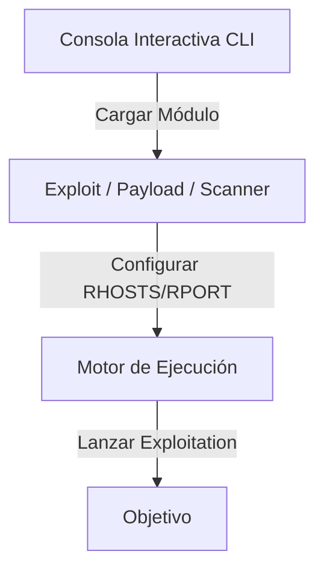

# Mini Metasploit Framework

<span style="background-color: #2ea44f; color: white; padding: 4px 8px; border-radius: 4px; font-weight: bold;">Nivel Avanzado</span>

## 📝 Descripción
Framework de explotación modular con consola interactiva, módulos de exploit configurables e historial.

## 🛠️ Arquitectura y Flujo de Datos


## 🧠 Explicación Técnica y Conceptos Clave
Inspirado en Metasploit, este framework está estructurado de manera modular. Define clases base para los módulos que se pueden importar y ejecutar de forma dinámica en tiempo de ejecución. Permite configurar variables globales, seleccionar payloads específicos de ejecución de código y lanzar ataques organizados.

## 💻 Código de Ejemplo o Estructura Lógica
```python
class BaseExploit:
    def __init__(self):
        self.options = {}
    def run(self):
        raise NotImplementedError

class ExploitRCE(BaseExploit):
    def run(self):
        target = self.options.get('RHOST')
        print(f"Lanzando exploit contra {target}...")
```

## 🔗 Código Fuente y Acceso en GitHub
Puedes ver la implementación completa del código y probar este script directamente accediendo a su carpeta de proyecto:
[Ver código en GitHub](https://github.com/lucasmdg/CIBER/tree/main/ciberseguridad/nivel_avanzado/02_mini_metasploit_like_tool)
