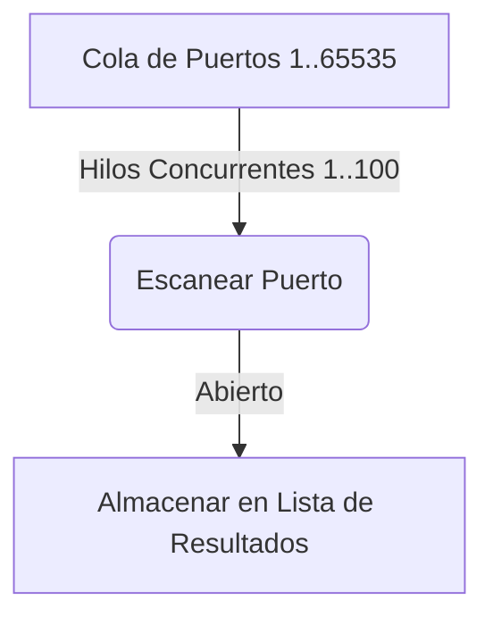

# Multithreaded Port Scanner

<span style="background-color: #2ea44f; color: white; padding: 4px 8px; border-radius: 4px; font-weight: bold;">Nivel Intermedio</span>

## 📝 Descripción
Escáner de puertos con 100 hilos simultáneos. Escanea 65.535 puertos en segundos.

## 🛠️ Arquitectura y Flujo de Datos


## 🧠 Explicación Técnica y Conceptos Clave
El escaneo de puertos secuencial es extremadamente lento cuando se auditan miles de puertos. Este escáner utiliza concurrencia mediante hilos (`threading`) y colas de tareas (`Queue`) para realizar múltiples intentos de conexión simultáneamente de forma segura, reduciendo el tiempo de escaneo global a pocos segundos.

## 💻 Código de Ejemplo o Estructura Lógica
```python
import threading
from queue import Queue
import socket

queue = Queue()
def worker():
    while not queue.empty():
        port = queue.get()
        # scan logic here
        queue.task_done()
```

## 🔗 Código Fuente y Acceso en GitHub
Puedes ver la implementación completa del código y probar este script directamente accediendo a su carpeta de proyecto:
[Ver código en GitHub](https://github.com/lucasmdg/CIBER/tree/main/ciberseguridad/nivel_intermedio/02_multithreaded_port_scanner)
