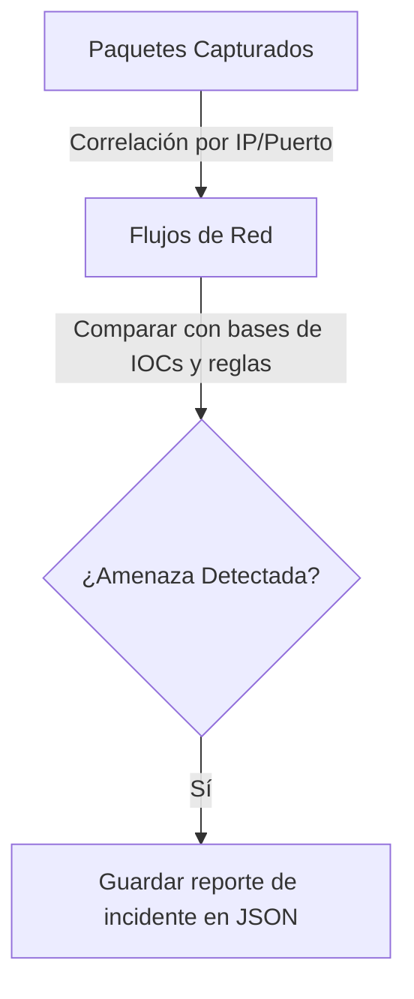

# Network IDS (NIDS)

<span style="background-color: #2ea44f; color: white; padding: 4px 8px; border-radius: 4px; font-weight: bold;">Nivel Avanzado</span>

## 📝 Descripción
IDS de red con análisis de flujos, Threat Intelligence, detección de exfiltración y reportes JSON.

## 🛠️ Arquitectura y Flujo de Datos


## 🧠 Explicación Técnica y Conceptos Clave
Este sistema de detección de intrusiones de red avanzado (NIDS) agrupa paquetes en flujos lógicos bidireccionales de red (conversaciones). Implementa integración con bases de datos de Inteligencia de Amenazas (Threat Intelligence) para interceptar IPs conocidas de botnets y aplica reglas complejas para detectar anomalías de exfiltración de información (como gran cantidad de paquetes saliendo a puertos inusuales).

## 💻 Código de Ejemplo o Estructura Lógica
```python
# Agrupación básica de flujos de red
from collections import defaultdict

flows = defaultdict(list)
def add_to_flow(pkt):
    if pkt.haslayer('IP') and pkt.haslayer('TCP'):
        flow_key = tuple(sorted([pkt['IP'].src, pkt['IP'].dst]) + sorted([pkt['TCP'].sport, pkt['TCP'].dport]))
        flows[flow_key].append(pkt)
```

## 🔗 Código Fuente y Acceso en GitHub
Puedes ver la implementación completa del código y probar este script directamente accediendo a su carpeta de proyecto:
[Ver código en GitHub](https://github.com/lucasmdg/CIBER/tree/main/ciberseguridad/nivel_avanzado/04_network_intrusion_detection_system)
