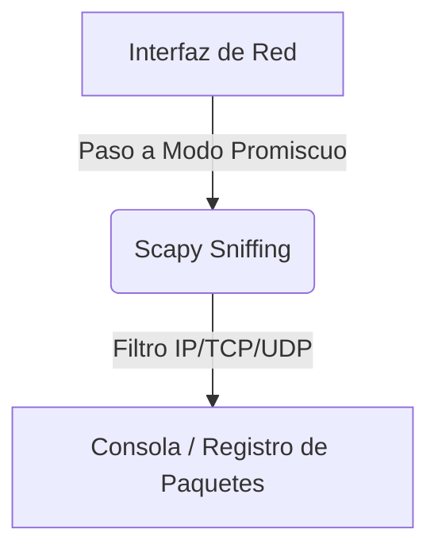

# Network Sniffer

<span style="background-color: #2ea44f; color: white; padding: 4px 8px; border-radius: 4px; font-weight: bold;">Nivel Básico</span>

## 📝 Descripción
Capturador de paquetes de red básico con Scapy. Muestra tráfico en tiempo real a nivel de capa 3.

## 🛠️ Arquitectura y Flujo de Datos


## 🧠 Explicación Técnica y Conceptos Clave
El sniffado de paquetes permite capturar y analizar el tráfico que circula por la interfaz de red. Usando la potente biblioteca `Scapy`, este script pone la interfaz en modo promiscuo de forma lógica para leer los paquetes IP, TCP y UDP que entran o salen del equipo.

## 💻 Código de Ejemplo o Estructura Lógica
```python
from scapy.all import sniff

def packet_callback(packet):
    if packet.haslayer('IP'):
        print(f"Origen: {packet['IP'].src} -> Destino: {packet['IP'].dst}")

# sniff(prn=packet_callback, count=10)
```

## 🔗 Código Fuente y Acceso en GitHub
Puedes ver la implementación completa del código y probar este script directamente accediendo a su carpeta de proyecto:
[Ver código en GitHub](https://github.com/lucasmdg/CIBER/tree/main/ciberseguridad/nivel_basico/10_network_sniffer_basico)
