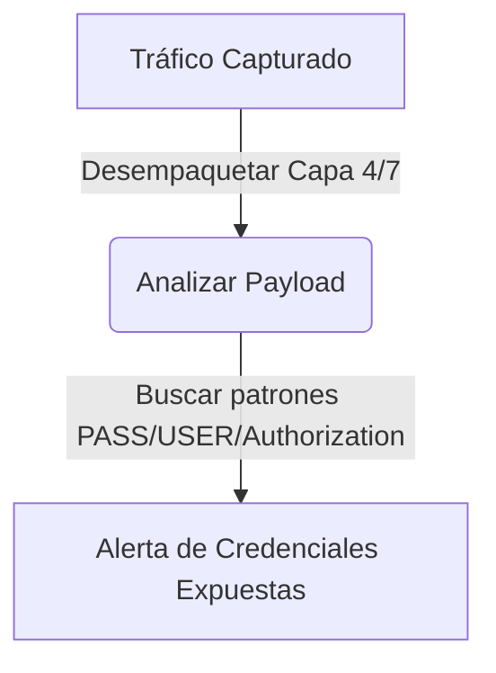

# Packet Sniffer Avanzado

<span style="background-color: #2ea44f; color: white; padding: 4px 8px; border-radius: 4px; font-weight: bold;">Nivel Intermedio</span>

## 📝 Descripción
Sniffer con filtrado por protocolo, detección de credenciales en texto plano y análisis de payloads.

## 🛠️ Arquitectura y Flujo de Datos


## 🧠 Explicación Técnica y Conceptos Clave
Un analizador de paquetes intermedio no solo muestra direcciones IP, sino que inspecciona el payload (datos útiles) del paquete en busca de protocolos inseguros (como HTTP, FTP o Telnet). Busca cadenas de texto plano que revelen credenciales o tokens de sesión en tránsito.

## 💻 Código de Ejemplo o Estructura Lógica
```python
def analyze_payload(packet):
    if packet.haslayer('Raw'):
        payload = packet['Raw'].load.decode(errors='ignore')
        if "user" in payload.lower() or "pass" in payload.lower():
            print(f"Alerta: Posible credencial interceptada: {payload}")
```

## 🔗 Código Fuente y Acceso en GitHub
Puedes ver la implementación completa del código y probar este script directamente accediendo a su carpeta de proyecto:
[Ver código en GitHub](https://github.com/lucasmdg/CIBER/tree/main/ciberseguridad/nivel_intermedio/05_packet_sniffer_avanzado)
