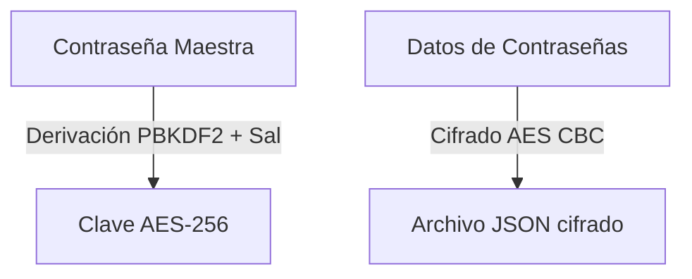

# Password Locker v2

<span style="background-color: #2ea44f; color: white; padding: 4px 8px; border-radius: 4px; font-weight: bold;">Nivel Intermedio</span>

## 📝 Descripción
Versión mejorada con AES-256, PBKDF2, categorías y fechas de creación para cada entrada.

## 🛠️ Arquitectura y Flujo de Datos


## 🧠 Explicación Técnica y Conceptos Clave
A diferencia de la versión básica, este gestor utiliza el estándar de la industria AES-256 en modo de encadenamiento de bloques (CBC) combinado con la función de derivación de claves PBKDF2 (Password-Based Key Derivation Function 2) con SHA-256 e iteraciones para mitigar ataques de diccionario por GPU.

## 💻 Código de Ejemplo o Estructura Lógica
```python
from cryptography.hazmat.primitives.kdf.pbkdf2 import PBKDF2HMAC
from cryptography.hazmat.primitives import hashes
import os

salt = os.urandom(16)
kdf = PBKDF2HMAC(
    algorithm=hashes.SHA256(),
    length=32,
    salt=salt,
    iterations=100000
)
key = kdf.derive(b"MasterPassword")
```

## 🔗 Código Fuente y Acceso en GitHub
Puedes ver la implementación completa del código y probar este script directamente accediendo a su carpeta de proyecto:
[Ver código en GitHub](https://github.com/lucasmdg/CIBER/tree/main/ciberseguridad/nivel_intermedio/01_password_locker_mejorado)
