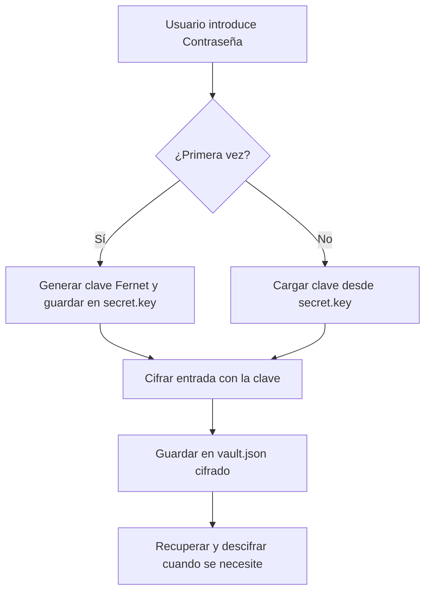

# Password Locker — Almacén Seguro de Contraseñas

<span style="background-color: #2ea44f; color: white; padding: 4px 8px; border-radius: 4px; font-weight: bold;">Nivel Básico</span>

---

## 📝 ¿Qué hace este proyecto?

Un **gestor de contraseñas local** que permite guardar y recuperar credenciales (usuario + contraseña) cifradas en un archivo JSON. La clave de cifrado se genera una sola vez y se guarda en disco. Sin esa clave, el archivo de contraseñas es ilegible.

---

## 🛠️ Arquitectura y Flujo de Datos



---

## 🧠 Conceptos Técnicos Clave

### ¿Qué es Fernet?

**Fernet** es una especificación de cifrado simétrico de alto nivel de la biblioteca `cryptography` de Python. Bajo el capó utiliza:

- **AES-128 en modo CBC** para el cifrado de los datos
- **HMAC-SHA256** para autenticación e integridad (el archivo no puede modificarse sin que se detecte)
- **IV aleatorio** para cada mensaje (mismo texto → distinto cifrado cada vez)
- **Timestamps** integrados que permiten establecer tiempos de expiración

```
Texto Plano
    │
    ▼
┌─────────────────────────────────────┐
│  IV (16 bytes aleatorios)           │
│  AES-128-CBC(texto_plano, key)      │
│  HMAC-SHA256(IV + ciphertext)       │
└─────────────────────────────────────┘
    │
    ▼
Base64(IV + ciphertext + HMAC) = Token Fernet
```

### ¿Por qué es seguro?

| Ataque | ¿Protegido? | Motivo |
|--------|-------------|--------|
| Lectura del archivo | ✅ Sí | AES-128 con clave secreta |
| Modificación del archivo | ✅ Sí | HMAC detecta cualquier cambio |
| Reutilización del cifrado | ✅ Sí | IV aleatorio por mensaje |
| Fuerza bruta | ⚠️ Depende | Clave de 128 bits: segura; contraseña del usuario: punto débil |

---

## 💻 Guía de Uso Paso a Paso

### 1. Instalación

```bash
pip install cryptography
cd ciberseguridad/nivel_basico/01_password_locker
```

### 2. Primer uso — Generar la clave y añadir una contraseña

```bash
python main.py
```

```
=== Password Locker ===
1. Guardar contraseña
2. Recuperar contraseña
3. Listar entradas
4. Salir

Opción: 1
Servicio (ej: github): github
Usuario: lucasmdg
Contraseña: MySuperSecretPass123!

[✓] Contraseña para 'github' guardada correctamente.
```

### 3. Recuperar una contraseña

```
Opción: 2
Servicio a recuperar: github

[+] Servicio: github
    Usuario:  lucasmdg
    Password: MySuperSecretPass123!
```

### 4. Verificar el archivo generado

```bash
cat vault.json
```

```json
{
  "github": {
    "usuario": "lucasmdg",
    "password": "gAAAAABk...Tk9fQ=="
  }
}
```
> El token `gAAAAAABk...` es el texto cifrado con Fernet. Sin la `secret.key`, es imposible descifrarlo.

---

## 💻 Código Explicado

```python
from cryptography.fernet import Fernet

# Generación de clave — SOLO HACER UNA VEZ
# Una clave Fernet es 32 bytes generados criptográficamente
# y codificados en Base64 URL-safe
key = Fernet.generate_key()
# Ejemplo: b'kdJx_lM3t2CwD..._X8='

# Guardar la clave en disco (protégela bien)
with open("secret.key", "wb") as f:
    f.write(key)

# Crear instancia del cifrador
cipher = Fernet(key)

# Cifrar un dato
texto_plano = b"MiContraseñaSecreto"
texto_cifrado = cipher.encrypt(texto_plano)
# El resultado cambia cada vez aunque el texto sea el mismo (IV aleatorio)

# Descifrar
recuperado = cipher.decrypt(texto_cifrado)
print(recuperado.decode())  # → MiContraseñaSecreto
```

---

## ⚠️ Limitaciones y Mejoras

| Limitación | Mejora propuesta |
|------------|-----------------|
| La clave se guarda en disco sin protección | Derivar la clave desde una contraseña maestra (ver [[Password Locker v2\|Password-Locker-v2]]) |
| Sin categorías ni búsqueda | Añadir campos adicionales al JSON |
| Sin interfaz gráfica | Crear un TUI con `rich` o interfaz web con Flask |
| Un solo archivo de vault | Soporte para múltiples vaults |

---

## 🔗 Código Fuente

[Ver código completo en GitHub](https://github.com/lucasmdg/CIBER/tree/main/ciberseguridad/nivel_basico/01_password_locker)

**Siguiente paso recomendado:** [[Password Locker v2|Password-Locker-v2]] — versión con AES-256 real y contraseña maestra
