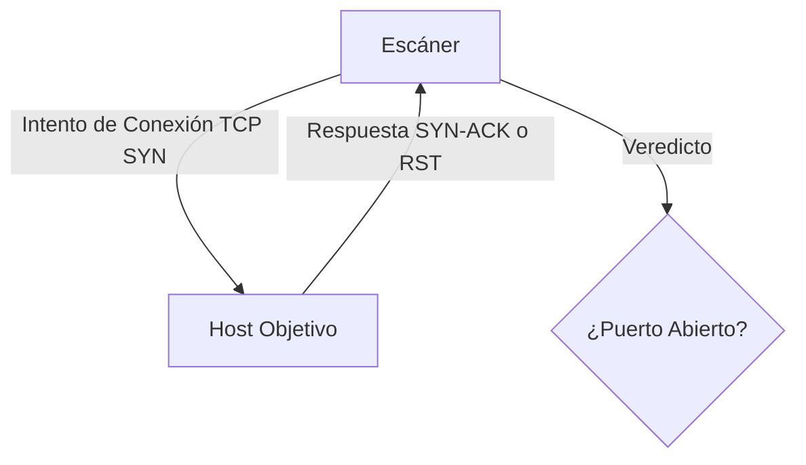

# Port Scanner

<span style="background-color: #2ea44f; color: white; padding: 4px 8px; border-radius: 4px; font-weight: bold;">Nivel Básico</span>

## 📝 Descripción
Escáner de puertos TCP que identifica servicios abiertos en un host objetivo usando sockets raw.

## 🛠️ Arquitectura y Flujo de Datos


## 🧠 Explicación Técnica y Conceptos Clave
El escáner de puertos es una herramienta de reconocimiento esencial en ciberseguridad. Funciona intentando establecer conexiones TCP de tres vías (3-way handshake) con un rango de puertos específicos de un host objetivo. Si el socket se conecta con éxito (código de retorno 0), el puerto se considera abierto.

## 💻 Código de Ejemplo o Estructura Lógica
```python
import socket

def scan_port(host, port):
    s = socket.socket(socket.AF_INET, socket.SOCK_STREAM)
    s.settimeout(1.0)
    result = s.connect_ex((host, port))
    if result == 0:
        print(f"Puerto {port}: ABIERTO")
    s.close()
```

## 🔗 Código Fuente y Acceso en GitHub
Puedes ver la implementación completa del código y probar este script directamente accediendo a su carpeta de proyecto:
[Ver código en GitHub](https://github.com/lucasmdg/CIBER/tree/main/ciberseguridad/nivel_basico/02_port_scanner)
