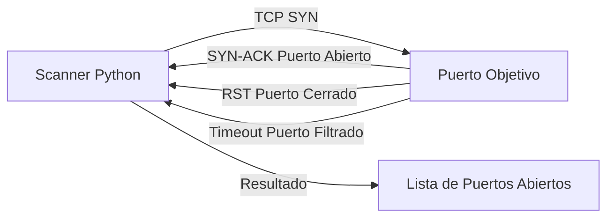

# Port Scanner — Escáner de Puertos TCP

<span style="background-color: #2ea44f; color: white; padding: 4px 8px; border-radius: 4px; font-weight: bold;">Nivel Básico</span>

---

## 📝 ¿Qué hace este proyecto?

Identifica qué **puertos TCP están abiertos** en un host objetivo, probando conexiones en un rango dado. Es la base de cualquier reconocimiento en seguridad: saber qué servicios tiene expuestos un servidor.

---

## 🛠️ Arquitectura y Flujo de Datos



---

## 🧠 Conceptos Técnicos Clave

### El Protocolo TCP y el 3-Way Handshake

TCP (Transmission Control Protocol) establece conexiones mediante un proceso de **tres pasos**:

```
Cliente (Scanner)              Servidor (Objetivo)
      │                               │
      │──── SYN (Sync) ──────────────►│  "Quiero conectarme"
      │                               │
      │◄─── SYN-ACK ─────────────────│  "Aceptado, confirma"
      │     (si puerto abierto)       │
      │                               │
      │──── ACK ─────────────────────►│  "Confirmado"
      │                               │
      │      CONEXIÓN ESTABLECIDA     │
```

Cuando el scanner intenta esto y recibe el `SYN-ACK`, **sabe que el puerto está abierto** — tiene un servicio escuchando.

### Estados de un Puerto

| Estado | ¿Qué ocurre? | Motivo |
|--------|-------------|--------|
| **ABIERTO** | Recibe `SYN-ACK` | Hay un servicio escuchando |
| **CERRADO** | Recibe `RST` | No hay servicio, pero el host existe |
| **FILTRADO** | Timeout sin respuesta | Firewall descarta el paquete silenciosamente |

### Puertos Más Comunes que Debes Conocer

| Puerto | Servicio | Relevancia en Seguridad |
|--------|----------|-------------------------|
| 21 | FTP | ⚠️ Credenciales en texto plano |
| 22 | SSH | Objetivo frecuente de brute force |
| 23 | Telnet | ❌ Inseguro, en desuso |
| 25 | SMTP | Posible relay de spam |
| 53 | DNS | Exfiltración via DNS |
| 80 | HTTP | Aplicaciones web (sin HTTPS) |
| 443 | HTTPS | Aplicaciones web cifradas |
| 445 | SMB | EternalBlue (MS17-010) |
| 3306 | MySQL | BD expuesta directamente |
| 3389 | RDP | Acceso remoto Windows |
| 8080 | HTTP-alt | Paneles de administración |

---

## 💻 Guía de Uso Paso a Paso

### 1. Instalación

```bash
# No requiere dependencias externas
cd ciberseguridad/nivel_basico/02_port_scanner
```

### 2. Escaneo básico

```bash
python main.py
```

```
=== Port Scanner ===
Host objetivo: 192.168.1.1
Puerto inicial: 1
Puerto final: 1024

[*] Escaneando 192.168.1.1 del puerto 1 al 1024...

[+] Puerto 22  ABIERTO  →  SSH
[+] Puerto 80  ABIERTO  →  HTTP
[+] Puerto 443 ABIERTO  →  HTTPS

[✓] Escaneo completado en 12.4 segundos.
    3 puertos abiertos de 1024 escaneados.
```

### 3. Interpretar resultados

Si encuentras un puerto **22 abierto**, significa que hay un servidor SSH. Esto te dice:
- El sistema es probablemente Linux/Unix
- Hay una interfaz de acceso remoto por línea de comandos
- Posible vector de ataque: brute force (ver [[SSH Bruteforce Tool|SSH-Bruteforce-Tool]])

Si encuentras **3306 abierto**, hay una base de datos MySQL expuesta directamente a la red — esto es una **vulnerabilidad grave** en producción.

---

## 💻 Código Explicado

```python
import socket

def scan_port(host: str, port: int, timeout: float = 1.0) -> bool:
    """
    Intenta una conexión TCP al puerto.
    Devuelve True si está abierto, False si está cerrado/filtrado.
    """
    # socket.AF_INET    → IPv4
    # socket.SOCK_STREAM → TCP (vs UDP = SOCK_DGRAM)
    s = socket.socket(socket.AF_INET, socket.SOCK_STREAM)
    
    # Timeout crucial: sin él, un puerto filtrado bloquea el programa
    s.settimeout(timeout)
    
    # connect_ex() devuelve 0 si la conexión se establece (éxito)
    # Cualquier otro código = error (puerto cerrado, filtrado, etc.)
    resultado = s.connect_ex((host, port))
    
    s.close()
    return resultado == 0

# Escaneo de rango completo
host = "192.168.1.1"
for port in range(1, 1025):
    if scan_port(host, port):
        try:
            # getservbyport intenta identificar el servicio por número de puerto
            servicio = socket.getservbyport(port)
        except OSError:
            servicio = "desconocido"
        print(f"[+] Puerto {port:5d} ABIERTO  → {servicio}")
```

### ¿Por qué es lento sin threading?

Con `timeout=1.0` y 65535 puertos, un escaneo secuencial tarda:
```
65535 puertos × 1 segundo = ~18 horas ❌
```

La solución: **threading** (ver [[Multithreaded Port Scanner|Multithreaded-Port-Scanner]])
```
65535 puertos ÷ 100 hilos × 1 segundo = ~11 minutos ✅
```

---

## ⚠️ Consideraciones Éticas y Legales

> **Escanear puertos de sistemas ajenos sin autorización es ilegal en España y en la mayoría de países.** Utiliza solo en tu propia red o con permiso explícito.

**Entornos seguros para practicar:**
- Tu red doméstica y tus propios dispositivos
- Máquinas virtuales en VirtualBox/VMware (red interna)
- Plataformas de CTF: [HackTheBox](https://hackthebox.com), [TryHackMe](https://tryhackme.com)
- [Metasploitable](https://sourceforge.net/projects/metasploitable/) — VM vulnerable intencionalmente

---

## 🔗 Código Fuente

[Ver código completo en GitHub](https://github.com/lucasmdg/CIBER/tree/main/ciberseguridad/nivel_basico/02_port_scanner)

**Siguiente paso:** [[Multithreaded Port Scanner|Multithreaded-Port-Scanner]] — versión 100x más rápida con threading
