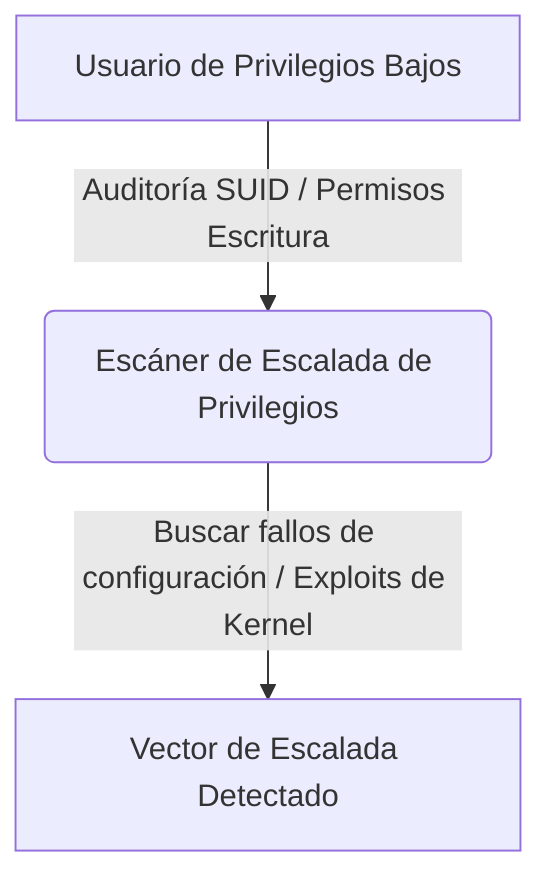

# Privilege Escalation Lab

<span style="background-color: #2ea44f; color: white; padding: 4px 8px; border-radius: 4px; font-weight: bold;">Nivel Avanzado</span>

## 📝 Descripción
Laboratorio que audita SUID, permisos, cron jobs, kernel exploits y PATH hijacking en un sistema.

## 🛠️ Arquitectura y Flujo de Datos


## 🧠 Explicación Técnica y Conceptos Clave
La escalada de privilegios consiste en comprometer un sistema y elevar los permisos hasta convertirse en Root/Administrador. Este script realiza auditorías automatizadas del entorno local de Linux buscando configuraciones erróneas (como archivos con bit SUID de ejecución propiedad de root modificables, tareas cron con rutas relativas expuestas a PATH Hijacking y sugerencias de kernel exploits basándose en la versión del OS).

## 💻 Código de Ejemplo o Estructura Lógica
```python
import os

def find_suid_files():
    # Encuentra archivos con permisos SUID
    suid_files = []
    for root, dirs, files in os.walk('/'):
        for name in files:
            path = os.path.join(root, name)
            try:
                if os.path.getmode(path) & 0o4000:
                    suid_files.append(path)
            except OSError:
                pass
    return suid_files
```

## 🔗 Código Fuente y Acceso en GitHub
Puedes ver la implementación completa del código y probar este script directamente accediendo a su carpeta de proyecto:
[Ver código en GitHub](https://github.com/lucasmdg/CIBER/tree/main/ciberseguridad/nivel_avanzado/06_privilege_escalation_lab)
