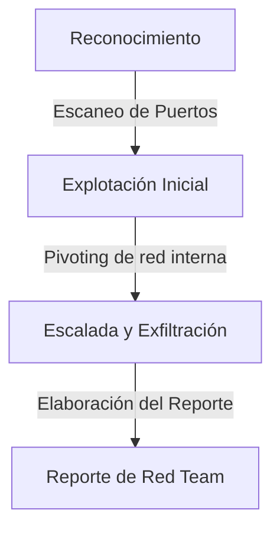

# Red Team Lab Simulation

<span style="background-color: #2ea44f; color: white; padding: 4px 8px; border-radius: 4px; font-weight: bold;">Nivel Avanzado</span>

## 📝 Descripción
Ejercicio completo de Red Team: recon, escaneo, explotación, pivoting, exfiltración y reporte final.

## 🛠️ Arquitectura y Flujo de Datos


## 🧠 Explicación Técnica y Conceptos Clave
Este entorno simula y documenta el ciclo de vida completo de un ataque persistente simulado. Sirve para guiar a los ingenieros a través de las fases de Reconocimiento (Passive/Active), Explotación de servicios mal configurados, Pivoting (utilizar un equipo comprometido como puente para atacar otros segmentos aislados de la red interna), persistencia y exfiltración segura de datos sensibles.

## 💻 Código de Ejemplo o Estructura Lógica
```python
# Simulación lógica de Pivoting
def port_forward(source_port, dest_ip, dest_port):
    print(f"Redireccionando tráfico local del puerto {source_port} a {dest_ip}:{dest_port}")
    # Código socket de túnel para puenteo de red interna
```

## 🔗 Código Fuente y Acceso en GitHub
Puedes ver la implementación completa del código y probar este script directamente accediendo a su carpeta de proyecto:
[Ver código en GitHub](https://github.com/lucasmdg/CIBER/tree/main/ciberseguridad/nivel_avanzado/10_red_team_lab_simulation)
