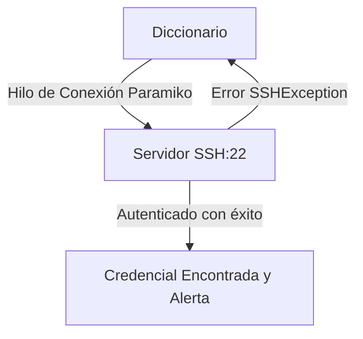

# SSH Bruteforce Tool

<span style="background-color: #2ea44f; color: white; padding: 4px 8px; border-radius: 4px; font-weight: bold;">Nivel Intermedio</span>

## 📝 Descripción
Herramienta multihilo de fuerza bruta SSH con Paramiko. Prueba contraseñas de un diccionario contra servidores SSH.

## 🛠️ Arquitectura y Flujo de Datos


## 🧠 Explicación Técnica y Conceptos Clave
El protocolo SSH es crítico para la gestión de servidores. Este script utiliza la biblioteca `Paramiko` de Python para automatizar intentos de conexión SSH usando credenciales de diccionario de manera concurrente. Sirve para auditar la fortaleza de las contraseñas de administración de la infraestructura.

## 💻 Código de Ejemplo o Estructura Lógica
```python
import paramiko

def test_ssh(ip, user, password):
    ssh = paramiko.SSHClient()
    ssh.set_missing_host_key_policy(paramiko.AutoAddPolicy())
    try:
        ssh.connect(ip, username=user, password=password, timeout=3)
        print(f"Credencial válida encontrada: {user}:{password}")
        ssh.close()
    except paramiko.AuthenticationException:
        pass
```

## 🔗 Código Fuente y Acceso en GitHub
Puedes ver la implementación completa del código y probar este script directamente accediendo a su carpeta de proyecto:
[Ver código en GitHub](https://github.com/lucasmdg/CIBER/tree/main/ciberseguridad/nivel_intermedio/09_ssh_bruteforce_tool)
