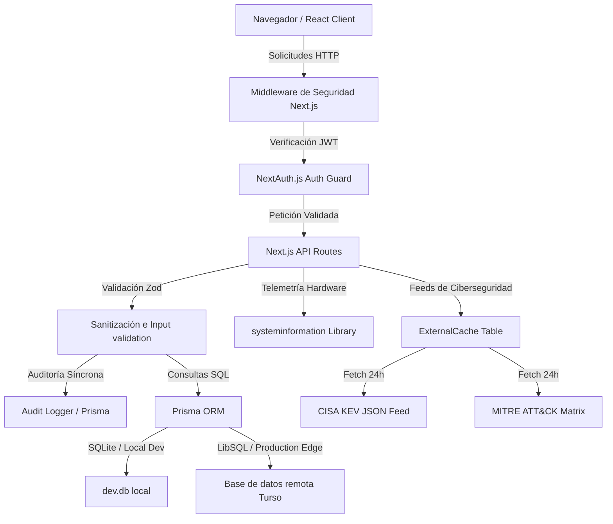

# 🗺️ Arquitectura y Diseño de Datos

SentinelX está diseñado bajo un modelo de arquitectura monolítica moderna impulsada por **Next.js 14 (App Router)**. Esto nos permite unificar el backend de la API, las páginas de visualización dinámicas renderizadas en el servidor (React Server Components), el control de sesiones y la lógica interactiva del cliente en un solo repositorio unificado.

---

## 🏗️ Diagrama de Flujo de Datos y Componentes

La siguiente arquitectura ilustra el flujo lógico desde la interacción del analista en el navegador hasta las capas persistentes de datos locales y externos:

---

## 🧠 Decisiones Clave de Arquitectura

### 1. Next.js App Router
Elegí Next.js App Router en lugar de una arquitectura separada (ej. React + Express) por tres motivos concretos:
- **Zero-API Data Fetching**: Los componentes del dashboard principal (como `DashboardPage`) obtienen datos directamente de la base de datos a nivel de servidor (Server Components) sin necesidad de exponer endpoints públicos vulnerables para la lectura inicial.
- **Rendimiento e Integridad**: Los Server Components reducen el tamaño de JavaScript descargado en el cliente y evitan el renderizado en blanco ("flash of unrendered content").
- **Mantenimiento**: Todo el ciclo de vida del código (rutas, base de datos, APIs de análisis estático) se mantiene coherente bajo un solo sistema de tipado TypeScript común.

### 2. Base de Datos SQLite (Desarrollo) y Turso (Producción)
- **SQLite**: Perfecto para desarrollo local y demostraciones ágiles. Funciona directamente en disco sin requerir levantar servicios pesados de bases de datos como PostgreSQL o MySQL.
- **Turso**: Al ser compatible con la API de SQLite (LibSQL), permite desplegar la demo en plataformas edge como Vercel sin alterar una sola línea de código de Prisma. Esto asegura persistencia real en producción de forma gratuita.

### 3. Middleware y NextAuth
Toda solicitud hacia rutas del dashboard o rutas de API críticas pasa por un filtro de Middleware. Si la sesión JWT es inexistente o ha expirado, el usuario es redirigido a `/login` a nivel de servidor, evitando la renderización de layouts comprometidos.

---

## 💾 Modelo de Entidades (Prisma)

El esquema de base de datos (`prisma/schema.prisma`) modela las siguientes entidades:
- **User / Session / Account**: Estructuras estándar compatibles con Auth.js para autenticación persistente y control de sesiones.
- **Asset**: Inventario físico/lógico de infraestructura (IP, OS, Criticality, RiskScore).
- **Vulnerability**: Repositorio de vulnerabilidades (CVEs, severidad, CVSS).
- **Finding**: Tabla intermedia de relación Many-to-Many que vincula qué vulnerabilidad está presente en qué activo.
- **ThreatActor / Malware**: Repositorio de firmas de inteligencia local de actores y payloads maliciosos.
- **PostureCheck**: Historial de los resultados del último escaneo de cumplimiento local ejecutado.
- **FileAnalysis**: Historial y veredictos detallados de los archivos binarios y scripts subidos por los analistas.
- **Incident / IncidentEvent**: Gestión de incidentes con su respectivo timeline cronológico de contención.
- **AuditLog**: Diario inmutable donde se registran las acciones ejecutadas por cada usuario (ej. `posture.scan`, `file.delete`, etc.).
- **ExternalCache**: Almacén genérico para las llamadas API remotas hacia CISA y MITRE, evitando latencias y bloqueos de red en el inicio.
