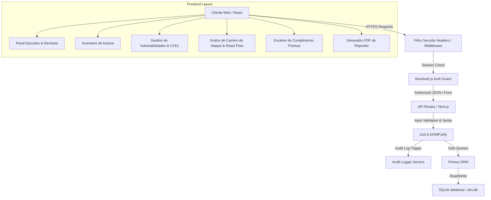

# SentinelX – Security Operations Center (SOC) Dashboard

<span style="background-color: #0052cc; color: white; padding: 4px 8px; border-radius: 4px; font-weight: bold;">Proyecto Principal / Capstone</span>

## 📝 Descripción
**SentinelX** es una plataforma web defensiva y educativa que simula una consola de Security Operations Center (SOC) de grado empresarial. Permite a analistas y administradores gestionar el inventario de activos, vulnerabilidades (CVEs), caminos de ataque (Attack Paths), inteligencia de amenazas (Threat Intel), cumplimiento de postura de seguridad y generación de informes ejecutivos en PDF.

## 🛠️ Arquitectura y Flujo de Datos


## 🧠 Explicación Técnica y Conceptos Clave
Este proyecto actúa como integrador y demostración de competencias Full-Stack en ciberseguridad, aplicando principios de **Diseño Seguro (Security by Design)**:
1. **Autenticación y Control de Acceso (RBAC):** Uso de NextAuth con JSON Web Tokens (JWT) expirables y validación de roles en endpoints de API para prevenir escalada de privilegios.
2. **Defensiva Activa:** Sanitización de inputs contra Cross-Site Scripting (XSS), rate-limiting para mitigar Denegación de Servicio (DoS), y un logger de auditoría inmutable en base de datos.
3. **Visualización de Datos:** Recharts para tendencias/métricas ejecutivas e integración de React Flow para mapear visualmente caminos lógicos que un atacante podría explotar (ej. Saltos desde DMZ a Controlador de Dominio).
4. **Cumplimiento y Postura:** Módulo simulado de escaneo de políticas de configuración y parches contra estándares de la industria (CIS Benchmarks, OWASP Top 10).

## 💻 Código de Ejemplo o Estructura Lógica
Ejemplo de esquema de validación con Zod y auditoría de eventos críticos al crear activos:

```typescript
// SentinelX/lib/security/validation.ts
import { z } from "zod";

export const assetCreateSchema = z.object({
  name: z.string().min(2).max(100),
  ip: z.string().ip({ version: "v4" }),
  os: z.string().min(2).max(50),
  owner: z.string().min(2).max(50),
  type: z.enum(["server", "workstation", "container", "cloud", "network"]),
  criticality: z.enum(["low", "medium", "high", "critical"]),
  riskScore: z.number().min(0).max(100)
});
```

```typescript
// SentinelX/app/api/assets/route.ts
export async function POST(req: Request) {
  const session = await getServerSession(authOptions);
  const role = session?.user?.role;
  if (!can(role, "assets:write")) {
    return NextResponse.json({ error: "forbidden" }, { status: 403 });
  }
  
  const body = await req.json();
  const parsed = assetCreateSchema.parse(body);
  const created = await prisma.asset.create({ data: parsed });
  
  await audit({
    actor: session.user.email,
    action: "asset.create",
    target: created.id,
    meta: { name: created.name }
  });
  
  return NextResponse.json({ asset: created }, { status: 201 });
}
```

## 🔗 Código Fuente y Acceso en GitHub
Puedes explorar y ejecutar la aplicación completa en:
[Ver SentinelX en GitHub](https://github.com/lucasmdg/CIBER/tree/main/SentinelX)
