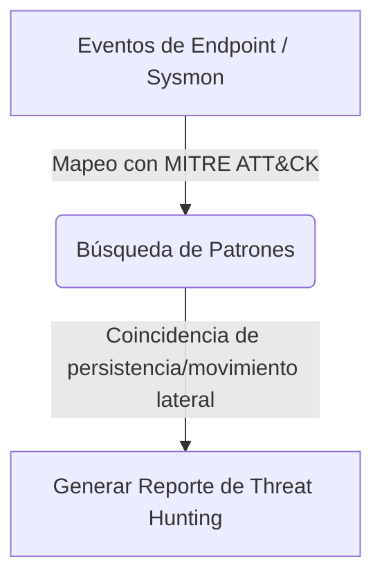

# Threat Hunting Lab

<span style="background-color: #2ea44f; color: white; padding: 4px 8px; border-radius: 4px; font-weight: bold;">Nivel Avanzado</span>

## 📝 Descripción
Caza proactiva de amenazas: fuerza bruta, movimiento lateral, exfiltración y matching de IOCs.

## 🛠️ Arquitectura y Flujo de Datos


## 🧠 Explicación Técnica y Conceptos Clave
El Threat Hunting es una táctica activa en la que los analistas buscan comportamientos sospechosos no detectados por herramientas convencionales. Este laboratorio automatiza la consulta e inspección sobre registros de procesos del endpoint (Sysmon/Windows Event Logs) mapeándolos contra técnicas de la matriz MITRE ATT&CK como manipulación de claves de registro para persistencia u ejecuciones inusuales de PowerShell.

## 💻 Código de Ejemplo o Estructura Lógica
```python
# Simulación de detección de ejecución sospechosa de powershell
def check_suspicious_process(proc_name, args):
    suspicious_args = ["-enc", "-nop", "-w hidden", "downloadstring"]
    if proc_name.lower() == "powershell.exe":
        for sa in suspicious_args:
            if sa in args.lower():
                print(f"Alerta: Comportamiento anómalo en proceso: {args}")
```

## 🔗 Código Fuente y Acceso en GitHub
Puedes ver la implementación completa del código y probar este script directamente accediendo a su carpeta de proyecto:
[Ver código en GitHub](https://github.com/lucasmdg/CIBER/tree/main/ciberseguridad/nivel_avanzado/09_threat_hunting_lab)
