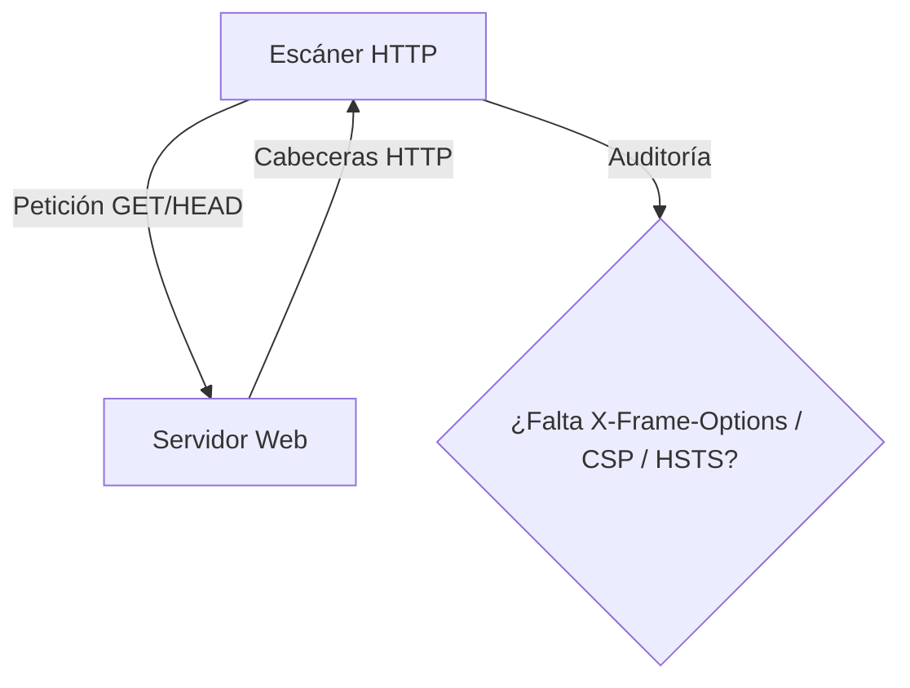

# Vulnerability Scanner

<span style="background-color: #2ea44f; color: white; padding: 4px 8px; border-radius: 4px; font-weight: bold;">Nivel Básico</span>

## 📝 Descripción
Escáner básico de cabeceras HTTP de seguridad. Detecta configuraciones inseguras en servidores web.

## 🛠️ Arquitectura y Flujo de Datos


## 🧠 Explicación Técnica y Conceptos Clave
Muchas vulnerabilidades web surgen de una mala configuración del servidor. Este escáner realiza peticiones HTTP y evalúa si faltan cabeceras críticas de mitigación de ataques (como `Content-Security-Policy` contra XSS, `Strict-Transport-Security` contra secuestro de conexiones, o `X-Frame-Options` contra Clickjacking).

## 💻 Código de Ejemplo o Estructura Lógica
```python
import requests

def scan_headers(url):
    response = requests.head(url)
    headers = response.headers
    missing = [h for h in ["Content-Security-Policy", "X-Frame-Options", "X-Content-Type-Options"] if h not in headers]
    print(f"Cabeceras faltantes: {missing}")
```

## 🔗 Código Fuente y Acceso en GitHub
Puedes ver la implementación completa del código y probar este script directamente accediendo a su carpeta de proyecto:
[Ver código en GitHub](https://github.com/lucasmdg/CIBER/tree/main/ciberseguridad/nivel_basico/09_simple_vulnerability_scanner)
