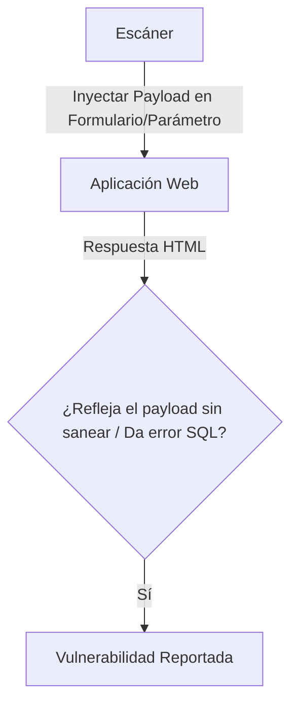

# Web Vulnerability Scanner

<span style="background-color: #2ea44f; color: white; padding: 4px 8px; border-radius: 4px; font-weight: bold;">Nivel Intermedio</span>

## 📝 Descripción
Escáner automático de vulnerabilidades web: cabeceras, XSS reflejado y SQL Injection basado en errores.

## 🛠️ Arquitectura y Flujo de Datos


## 🧠 Explicación Técnica y Conceptos Clave
Este escáner web automatiza pruebas de inyección. Para SQL Injection, inserta comillas (`'`) u operadores lógicos en parámetros URL y busca respuestas con errores del motor de base de datos. Para XSS (Cross-Site Scripting), inserta payloads como `<script>alert(1)</script>` y busca si se reflejan exactamente en el código HTML de salida.

## 💻 Código de Ejemplo o Estructura Lógica
```python
def test_sqli(url, param):
    payloads = ["'", "1' OR '1'='1"]
    for p in payloads:
        r = requests.get(url, params={param: p})
        if "syntax error" in r.text or "mysql" in r.text.lower():
            print(f"Posible SQLi detectada en parámetro: {param}")
```

## 🔗 Código Fuente y Acceso en GitHub
Puedes ver la implementación completa del código y probar este script directamente accediendo a su carpeta de proyecto:
[Ver código en GitHub](https://github.com/lucasmdg/CIBER/tree/main/ciberseguridad/nivel_intermedio/08_web_vulnerability_scanner)
